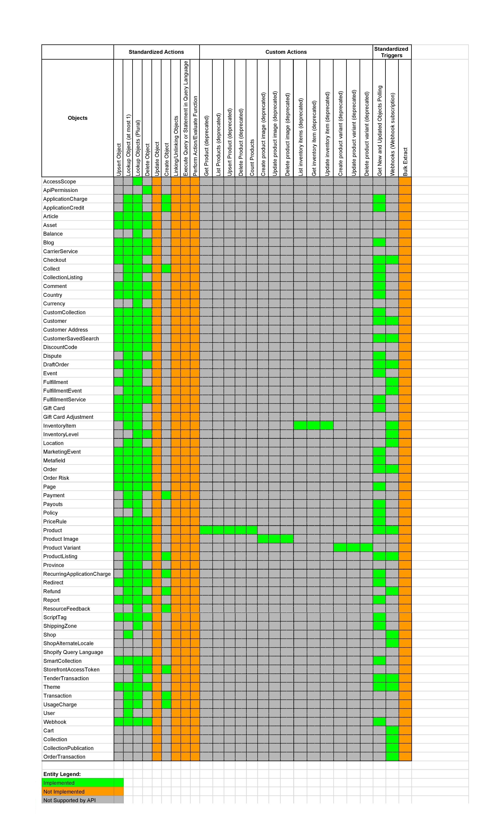

## Changelog

### 1.6.6 (December 02, 2022)

* Updated Sailor to 2.7.1

### 1.6.5 (September 23, 2022)

* Added retry on `429` error (respecting the `Retry-After` header)

### 1.6.4 (July 29, 2022)

* Added `email` support in `Upsert Object` action for `customer` objectType
* Improved error message
* Updated elasticio-sailor-nodejs to v2.6.29
* Updated oih-standard-library to v2.0.3

### 1.6.3 (July 1, 2022)

* Action `Lookup Objects` now uses method `search` instead of `list` for `customer` objectType

### 1.6.2 (June 17, 2022)

* Added information about required permissions for credential verification

### 1.6.1 (May 20, 2022)

* More info in logs if got errors

### 1.6.0 (May 06, 2022)

* Add validation the HMAC signature for `Webhook subscription` trigger

### 1.5.1 (April 08, 2022)

* Get rid of vulnerabilities in dependencies
* Add component pusher job to Circle.ci config

### 1.5.0 (March 25, 2022)

- Added new action `Update Inventory Level`
- Fixed output metadata for `Get New And Updated Objects Polling` trigger
- Upgraded `sailor-nodejs` to version 2.6.27

### 1.4.7 (March 15, 2022)

- Added component pusher build script

### 1.4.6 (February 11, 2022)

- Added *Time stamp field to poll on* field for `Get New and Updated Objects` trigger
- Fixed dynamic-metadata schema

### 1.4.5 (January 28, 2022)

* Fix `startTime` and `endTime` parameters processing for `Polling Trigger`

### 1.4.4 (December 10, 2021)

* Fix output metadata for `Lookup Objects` action

### 1.4.3 (November 26, 2021)

* Reduced the size of component icon file

### 1.4.2 (September 15, 2021)

*   Add Make Raw Request Action
*   Upgrade to Sailor `2.6.26`

### 1.4.1 (November 10, 2020)

*   Upgrade to sailor 2.6.18
*   Annual audit of the component code to check if it exposes a sensitive data in the logs
*   Annual npm vulnerabilities audit

### 1.4.0 (Sept 11, 2020)

* Add support for reading & writing metafields
* Bump dependencies
* Change API Key in credentials to password level
* Remove sensitive info from logs

### 1.3.0 (November 15, 2019)

**Triggers:**

* Add Webhook Subscription trigger
* Add Polling trigger

**Actions:**

* Add Create Object Action
* Add Upsert Object Action
* Depreacte updateProductVariant action
* Depreacte createProductVariant action
* Depreacte createProductImage action
* Depreacte updateProductImage action
* Depreacte upsertProduct action

### 1.2.0 (November 5, 2019)

**Actions:**

* Add Lookup Object Action
* Add Delete Object action
* Deprecate Get Product action
* Deprecate Get Inventory Item action
* Deprecate Delete Product action
* Deprecate Delete Product Image action
* Deprecate Delete Product Variant action

### 1.1.0 (October 4, 2019)

**Actions:**

* Add List Obejct action
* Deprecate List products
* Deprecate List inventory items

### 1.0.0 (May 7, 2018)

* Initial release

## Completeness Matrix

Here is the Shopify Admin component Completeness Matrix:

