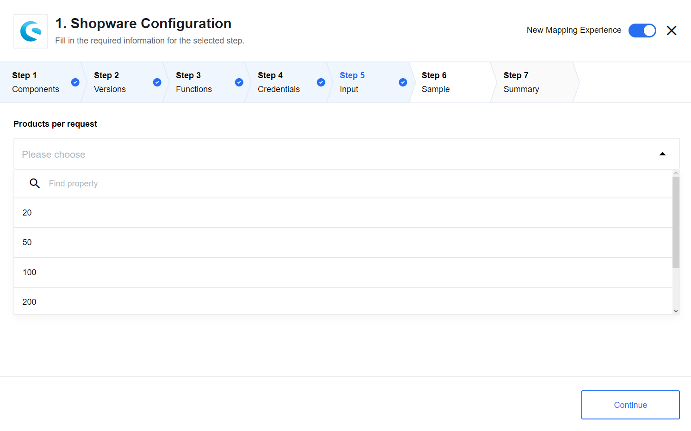
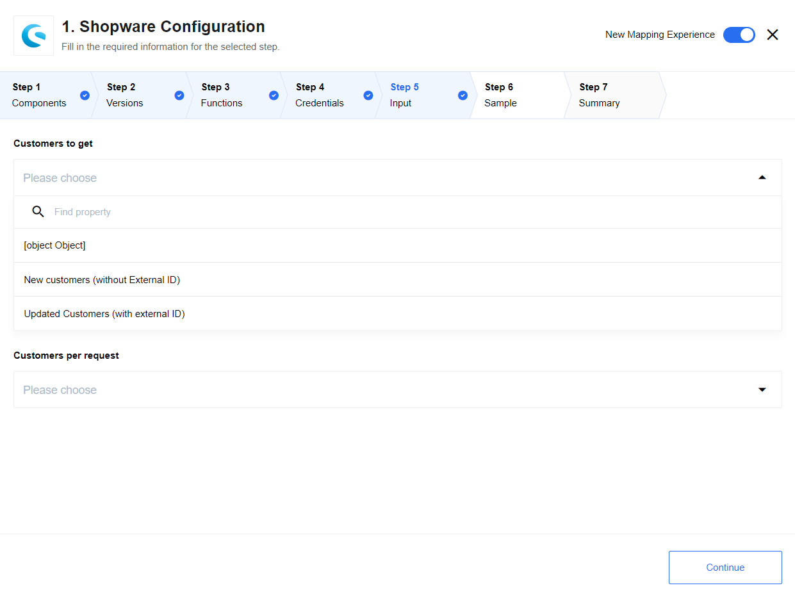
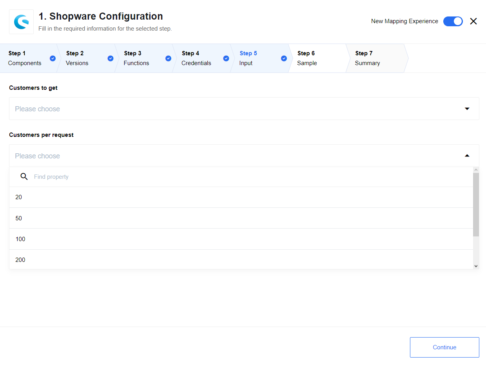
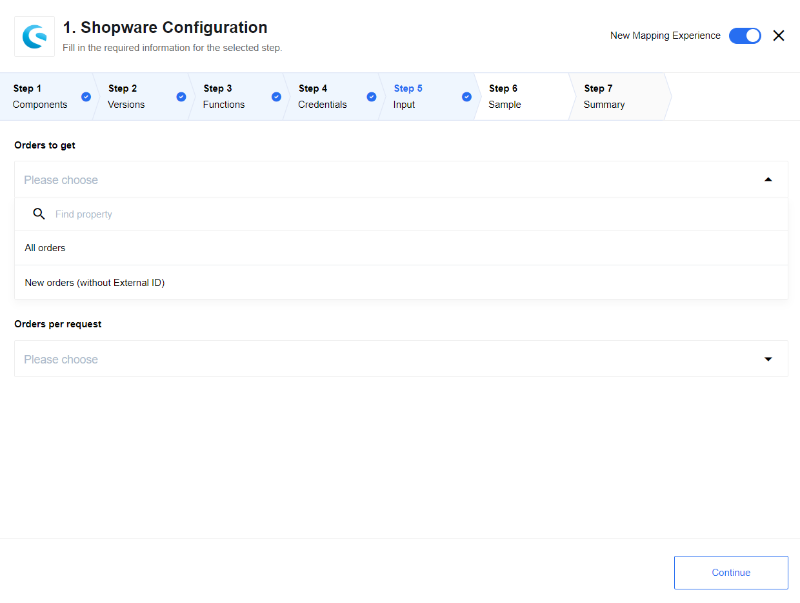
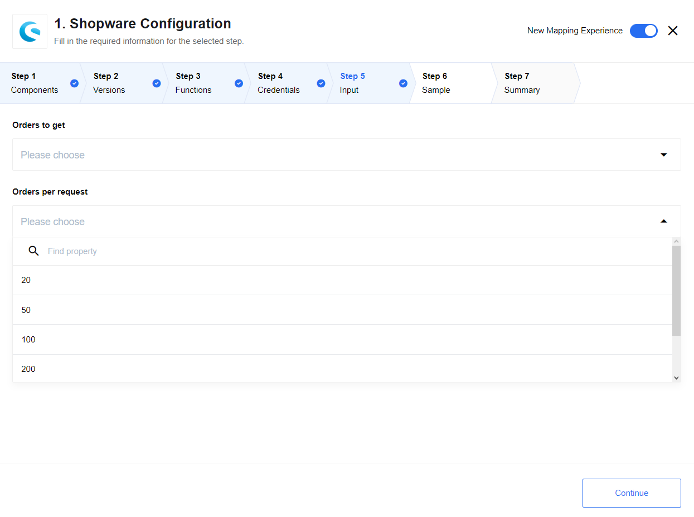
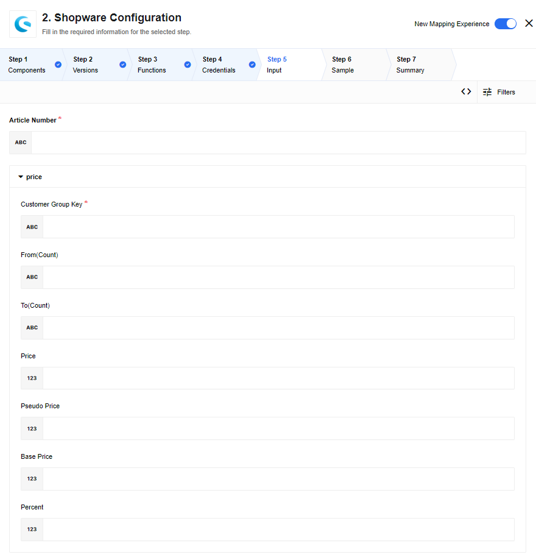
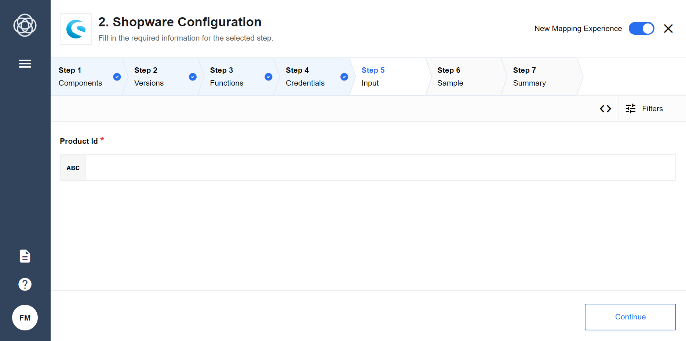
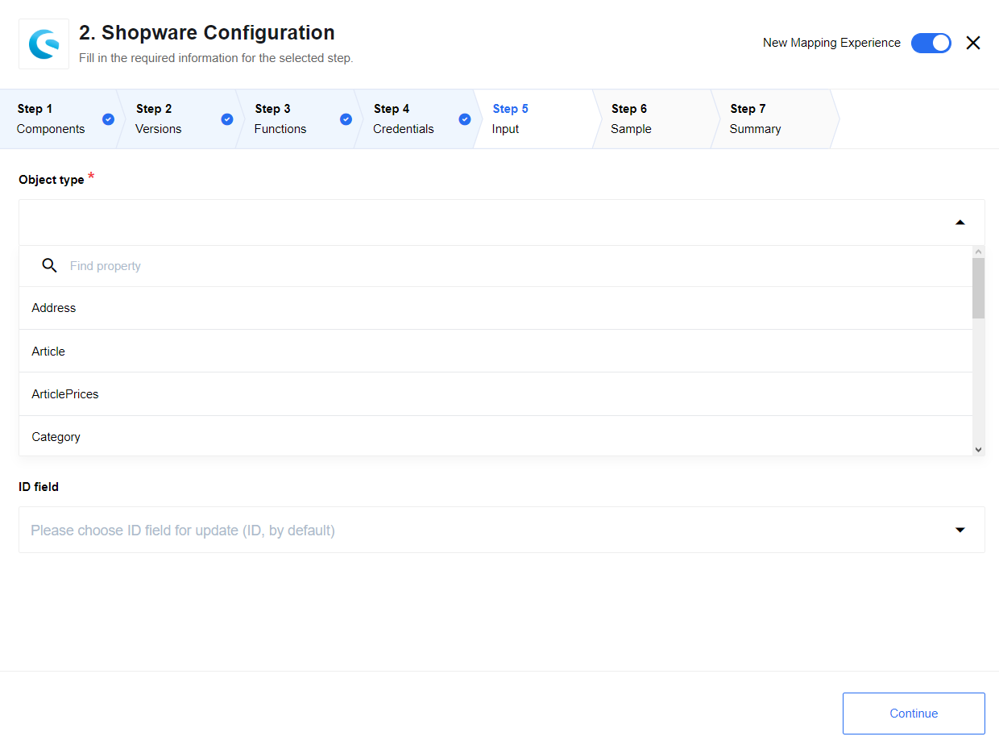

## Latest changelog

**1.1.2 (January 30, 2020)**

* Upgrade sailor to v2.5.4

> To see the full **changelog** please use the following [link](/components/shopware/changelog).

## Description

This is component for [Shopware](https://shopware.com/) eCommerce software which
is developed specifically to run on {{site.data.tenant.name}} platform.


## Requirements

> **PLEASE NOTE:** This component depends on [Shopware REST API extenstions](https://github.com/elasticio/elasticio-shopware-api-extension),
> please install it first before proceeding further.	please install it first before proceeding further.


**This component was tested with the Shopware version 5 (5.6).**

### Credentials

| Property name | Required |
|--------------|--------|
| BaseURL     | true   |
| User     | true   |
| Password      | true   |

### Query Articles/Products

Shopware has a concept of ``Artikel`` in German which their UI translates to
``Products`` in English which is available through their API at the ``/article``
endpoint.  There is a trigger ``Query Articles`` which queries for new & updated
products.  The results are returned in batches of the form

```
{
  data:
  [
  //items
  ]
}
```

The batch size is configurable as a parameter. The batches can be broken up by
the mapper as they proceed to the next step.

The output of this method includes only information about the product.  It does
not include information about the variants of the article.  This information can
be obtained by having the `Query Articles` trigger followed by the `Get
Article Details By Id` action.  This action will return all the details for an
article including information about the articles variants.

## Triggers

### Query Articles

Get new and updated article information through the /articles API.

#### Sample Example

```json
{
  "products": [
    {
      "taxId": 52277893,
      "name": "exercitation nostrud voluptate in",
      "description": "culpa ea",
      "descriptionLong": "quis sunt exercitation",
      "added": "velit minim aute",
      "pseudoSales": 38771027,
      "highlight": true,
      "keywords": "eu Ut ad",
      "metaTitle": "sint aliquip Excepteur nostrud",
      "changed": "Lorem ex",
      "lastStock": false,
      "availableFrom": "amet nisi ut cupidatat",
      "availableTo": "ad",
      "supplierId": -81844813,
      "active": -6545272
    }
  ]
}
```

#### Limitations

Orders per request: `20`, `50`, `100`, `200`, `500`, `1000`:



### Query Customers



#### Limitations

Orders per request: `20`, `50`, `100`, `200`, `500`, `1000`.



### Query Newsletter Subscribers

#### Sample Example

```json
{
  "id": -12202511,
  "email": "ullamco adipisicing sit consequat",
  "firstname": "est dolor",
  "lastname": "nostrud",
  "salutation": "aute ea velit Ut dolor",
  "isCustomer": false,
  "groupId": 8020795,
  "lastNewsletterId": 29310366,
  "lastReadId": 87374529
}
```

### Query Orders



#### Limitations

Orders per request: `20`, `50`, `100`, `200`, `500`, `1000`.



## Actions

### Add price

This action adds price to the selected article:



### Get Article Details By Id

Get article information through the /articles API:



### Upsert Object

Action creates a new object or updates object which already exists by provided ID (by default) or Number (MainDetail.Number).
This action makes POST request when get message body without ID to create new entity
and PUT request when get message body includes ID or Number to update existing object.
The request will be repeated ([rebound](/getting-started/rebound)) in case of
retrieving following error codes from the remoute server:
`408`, `423`, `429`, `500`, `502`, `503`, `504`.



## Deprecated Actions

### Update Customer

This action is deprecated, please use [Upsert Object By ID](/components/shopware/index.html#upsert-object) Action instead.

### Create or Update Product

This action is deprecated, please use [Upsert Object By ID](/components/shopware/index.html#upsert-object) Action instead.

### Create or Update Customer Group

This action is deprecated, please use [Upsert Object By ID](/components/shopware/index.html#upsert-object) Action instead.

### Update order

This action is deprecated, please use [Upsert Object By ID](/components/shopware/index.html#upsert-object) Action instead.

## Shopware API Limitations/Improvements

The Shopware API has many shortcomings which limit the ability to use Shopware
out of the box.  [Shopware allows for features to be requested in their issue
tracker](http://en.community.shopware.com/_detail_1282.html#Ticket_overview).
