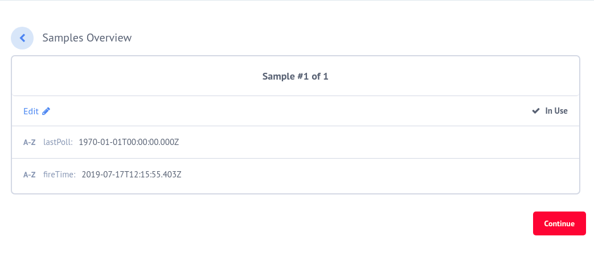

## Description

A component used to trigger integration flows without requesting data from any
services.

### How works

This component should be used as a first step in your flow to trigger integration flows.

## Requirements

This component should be the first step in your flow.

### Environment variables

Environment variables are not required for this component.

## Credentials

This component does not require credentials to work.

## Triggers

Simple trigger.

### Timer

This component can have a cronjob so you can choose when exactly and how often
you want this component to work.

## Actions

This component has no action functions.

## Others

Here is how generated sample looks. You also can edit it.

## Known limitations

There are no known limitations for this component.
