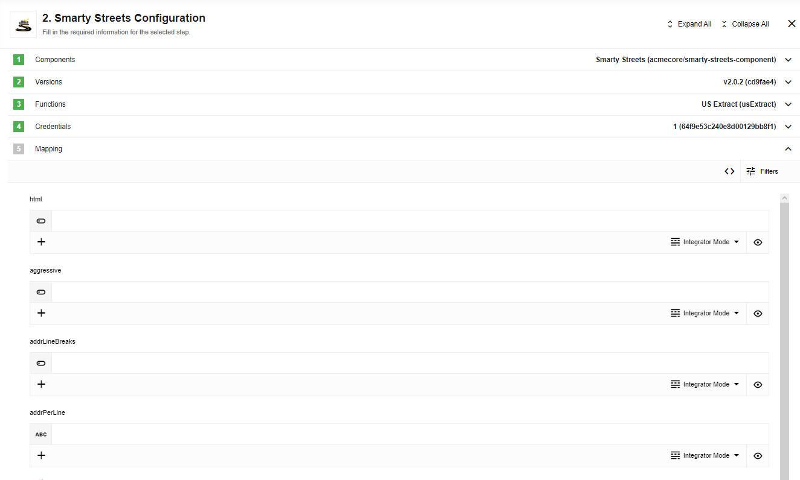

## Credentials

Key pairs must be kept secret, so they should not be used on client-side HTML or
in client-side applications. Use secret key pairs on server-side code that connects
directly to the Smarty-Streets API servers. A secret key pair is not limited to
any particular hostname like website keys are. A key pair consists of an ID to
identify your account and a token which is like a password.

### How to insert credentials

**Integrate** -> **Credentials** -> Smarty Streets -> Add New Credential

*   Enter Name of account.
*   Enter your `AuthId` and `AuthToken`.
*   Click on "Verify".
*   Click on "Save".

## Triggers

This component has no trigger functions. This means it will not be accessible to
select as a first component during the integration flow design.

## Actions

### International Street Address

Action to verify an international address using the Smarty-Streets International API.

> **Please Note:** This action can not be accessed from the free (test) account.
> Hence it can not be tested. You should have a real paid account to use or even test this action.

Request JSON schema `src/main/resources/schemas/json/InternationalStreetAddress.in.json`

### US Autocomplete

Action to use the Smarty-Streets US Autocomplete API.

> **Please Note:** Because the US Autocomplete API relies on the user to know
> their primary number, the returned suggestions do not necessarily represent
> valid addresses. These suggestions contain the house number provided as well
> as a valid street+city+state. Submitting those values to the US Street API
> will provide the fully validated address if one exists..

Request JSON schema `src/main/resources/schemas/json/USAutocomplete.in.json`

### US Extract

This action uses the extraction endpoint to find and validate addresses in arbitrary text input.

Request JSON schema `src/main/resources/schemas/json/USExtract.in.json`

### US Street Address

This action verifies one or more addresses using the Smarty-Streets US Street Address API.

Request JSON schema `src/main/resources/schemas/json/USStreetAddress.in.json`

### US Zip Code

Action allows you to look up and verify city, state, and ZIP Code combinations
using the Smarty-Streets APIs

Request JSON schema `src/main/resources/schemas/json/USZipCodeSingle.in.json`

## SmartyStreets API links

*   [Smarty-Streets API documentation](https://smartystreets.com/docs/sdk)
*   [Smarty-Streets International Street Address action documentation](https://smartystreets.com/docs/cloud/international-street-api)
*   [Smarty-Streets US Autocomplete action documentation](https://smartystreets.com/docs/cloud/us-autocomplete-api)
*   [Smarty-Streets US Extract action documentation](https://smartystreets.com/docs/cloud/us-extract-api)
*   [Smarty-Streets US Street Address action documentation](https://smartystreets.com/docs/cloud/us-street-api)
*   [Smarty-Streets US Zip Code action documentation](https://smartystreets.com/docs/cloud/us-zipcode-api)
*   [Smarty-Streets credentials documentation](https://smartystreets.com/docs/cloud/authentication#keypairs)
