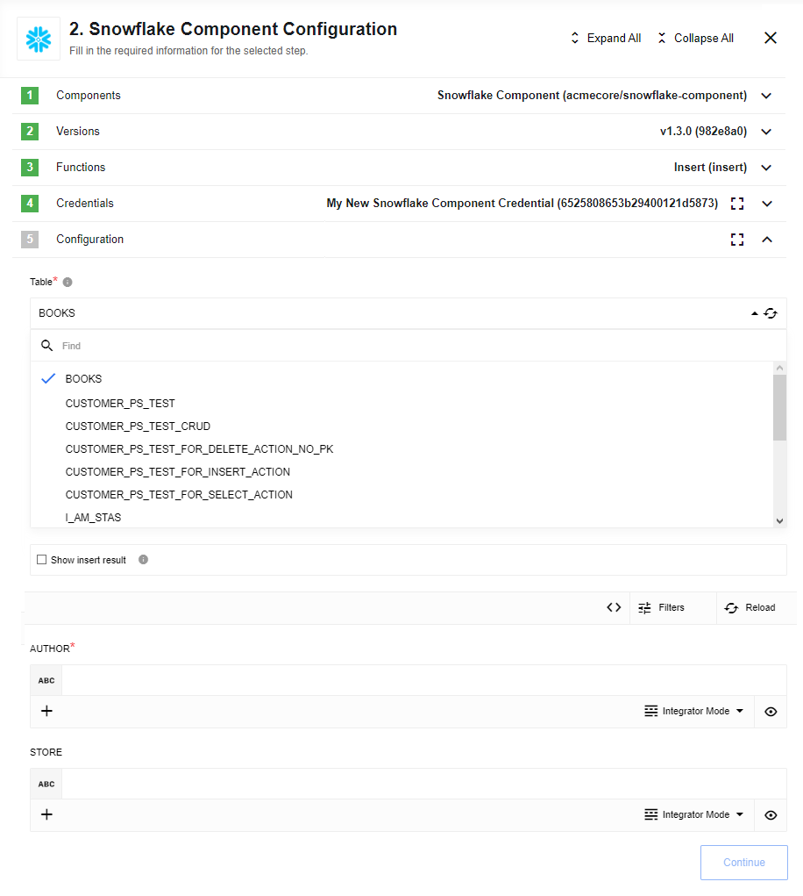
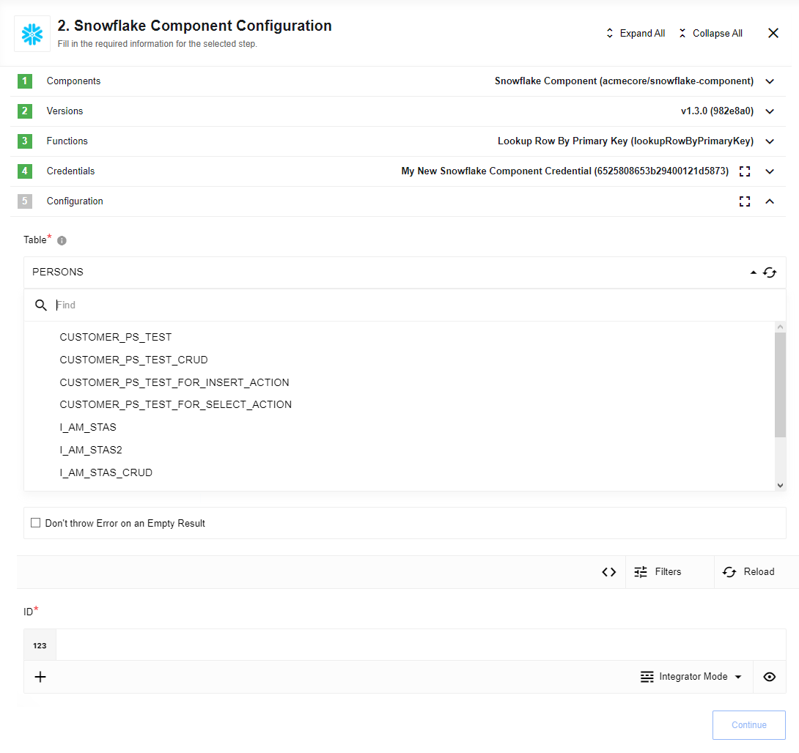
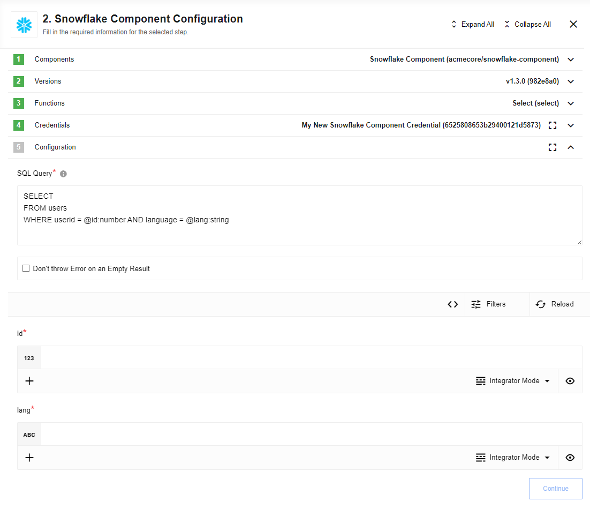

## Execute custom query action

**Important:** `Execute custom query` is advanced action and it's not protected from SQL-injection. So be aware of query you are trying to execute.

Action to execute custom SQL query from provided request string:


### Input Metadata

* **Query** to provide request string.

### Query Samples:

Select:

```sql
SELECT name, size FROM stars
```

Update:

```sql
INSERT INTO stars values (1,'Taurus', '2015-02-19 10:10:10.0', 123, 5, 'true', '2015-02-19')
```

## Insert action

This action will execute insert query into the specified table.



### Config Fields

* **Table** - Dropdown (required) to specify table where row will be inserted

* **Show insert result** - If selected (checked) then 'inserted object' will be returned as a result. Otherwise if not selected (not checked by default) then value '{ result: true }' will be returned as a result of successful insert operation

### Input Metadata

Dynamically generated list of properties according to selected `Table`

## Lookup row by primary key action

This action will lookup row by it's primary key



### Config Fields

* **Table** - Dropdown (required) to specify table where row will be searched

### Input Metadata

Dynamically generated `Primary key` according to selected `Table`

## Delete row by primary key action

This action will delete row by it's primary key


### Config Fields

* **Table** - Dropdown (required) to specify table from where row will be deleted

### Input Metadata

Dynamically generated `Primary key` according to selected `Table`

## Upsert row by primary key action

This action will execute upsert row by it's primary key. Which means if there is no row with the specified id, it will be inserted, if there is the row with provided id, row will be updated. If the number of rows that existing in the table with the same id is greater than 1, an error will be thrown

### Config Fields

* **Table** - Dropdown (required) to specify table where row will be upserted. Tables with only `Primary Key` columns will appear in the dropdown.

* **Show upsert result** - If selected (checked) then 'upserted object' will be returned as a result. Otherwise if not selected (not checked by default) then value '{ result: true }' will be returned as a result of successful upsert operation

### Input Metadata

Dynamically generated list of properties according to selected `Table`

## Select action

The action will execute an [SQL](https://en.wikipedia.org/wiki/SQL "SQL") query that can return multiple results, it has limitations on the query and suited only for SELECT type of queries.



In SQL query you can use clause variables with specific data types.
Internally we use prepared statements, so all incoming data is
validated against SQL injection, however we had to build a connection from JavaScript types to the SQL data types
therefore when doing a prepared statements, you would need to add ``:type`` to **each prepared statement variable**.

For example if you have a following SQL statement:

```sql
SELECT
FROM users
WHERE userid = @id AND language = @lang
```

you should add ``:type`` to each ``@parameter`` so your SQL query will looks like this:

```sql
SELECT
FROM users
WHERE userid = @id:number AND language = @lang:string
```

Following types are supported:
 * ``string``
 * ``number``
 * ``bigint``
 * ``boolean``
 * ``float``
 * ``date``

### Config Fields

* **Query** to provide request string.

### Input Metadata

Component supports dynamic incoming metadata - as soon as your query is in place it will be parsed and incoming metadata will be generated accordingly.

## Execute stored procedure action

This action calls stored procedure

### Config Fields

* **Stored procedure** - a name of a procedure to call, can be selected from the dropdown list

### Input Metadata

Metadata generates automatically using procedure parameters for input
