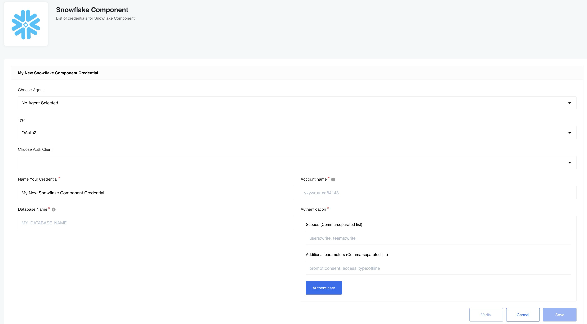

## General information

### Description

This is a component for management over Snowflake database on [{{site.data.tenant.name}} platform](http://www.{{site.data.tenant.name}}).
Snowflake supports the following constraint types from the ANSI SQL standard:
 - `UNIQUE`
 - `PRIMARY KEY`
 - `FOREIGN KEY`
 - `NOT NULL`
**Important:** - Snowflake supports defining and maintaining constraints, but does not enforce them, except for NOT NULL constraints, which are always enforced. [Overview of Snowflake Constraints](https://docs.snowflake.com/en/sql-reference/constraints-overview.html)
It means that:
  - Multiple rows can be created with the same `UNIQUE` value
  - Multiple rows can be created with the same `PRIMARY KEY` value
  - etc

### Environment variables

No required Environment variables.

## Credentials

### Account name

The full name of your account (provided by Snowflake). Note that your full account name might include additional segments that identify the region and cloud platform where your account is hosted

* **Username:** Snowflake user login name to connect with

* **Password:** Password for the user

* **User role:** Security role to use for the session after connecting

* **Warehouse:** The default virtual warehouse to use for the session after connecting

* **Database Name:** Database name

## Triggers

This component has no trigger functions. This means it will not be accessible to
select as a first component during the integration flow design.

## Actions

Snowflake component includes the following actions:

1. [Execute custom query action](/components/snowflake/actions.html#execute-custom-query-action) - Action to execute custom SQL query from provided request string.

2. [Insert action](/components/snowflake/actions.html#insert-action) - This action will execute insert query into the specified table.

3. [Lookup row by primary key action](/components/snowflake/actions.html#lookup-row-by-primary-key-action) - This action will lookup row by it's primary key

4. [Delete row by primary key action](/components/snowflake/actions.html#delete-row-by-primary-key-action) - This action will delete row by it's primary key

5. [Select action](/components/snowflake/actions.html#select-action) -The action will execute an [SQL](https://en.wikipedia.org/wiki/SQL "SQL") query that can return multiple results.
