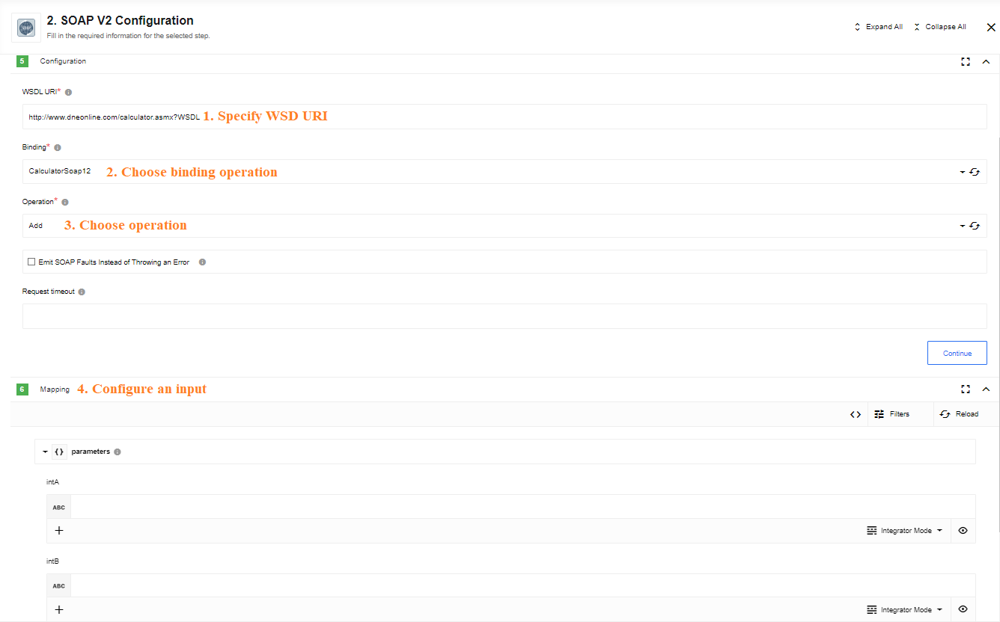

## Call

Makes a call to SOAP service over HTTP using public WSDL URL.
Call action supports Basic Authorization, choose Basic Authorization type in credentials and provide credentials for WSDL.



Call action supports Basic Authorization, chose Basic Authorization type in credentials and provide credentials for WSDL

### Input fields description

*   **WSDL URI** - Public URL address of the WSDL
*   **Binding** - One of the bindings available and described in the WSDL, which you want to use for a SOAP call
*   **Operation** - One of the operations available for the binding you have selected above.

### SOAP Fault

A SOAP fault is used to carry error information within a SOAP message. The component
handles SOAP faults and emits platform exception in this case. SOAP Fault should
comply with the [W3C SOAP Fault standard](https://www.w3.org/TR/soap12-part1/#soapfault).

### Input json schema

The component does not have static input json schema as it is dynamically generated
for every wsdl/binding/operation specified during the configuration of the component input fields.
[Apache Axis2](http://axis.apache.org/axis2/java/core/) and [FasterXML JsonSchemaGenerator](https://github.com/FasterXML/jackson-module-jsonSchema) tools are used by the component internally to generate an input metadata.
You can refer these tools documentation to get deeper understanding about the product.

### Output json schema

Output json schema is generated dynamically the same as for the input (see above).

### Additional information

**You should specify input fields exactly in the order below. You'll get an error otherwise**.
1. WSDL URI
2. Binding
3. Operation

## Soap Reply

soap-reply

Wraps and returns input data as SOAP response by provided SOAP metadata:


### Input fields description

*   **WSDL URI** - Public URL address of the WSDL
*   **Binding** - One of the bindings available and described in the WSDL, which you want to use for a SOAP call
*   **Operation** - One of the operations available for the binding you have selected above.

### Input json schema

The component does not have static input json schema as it is dynamically generated for every wsdl/binding/operation specified during the configuration of the component input fields.
[Apache Axis2](http://axis.apache.org/axis2/java/core/) and [FasterXML JsonSchemaGenerator](https://github.com/FasterXML/jackson-module-jsonSchema) tools are used by the component internally to generate an input metadata.
You can refer these tools documentation to get deeper understanding about the product.

### Output json schema

Output json schema is generated dynamically the same as for the input (see above).

### Input data example:

```json
{
  "AddResponse": {
    "AddResult": 3
  }
}
```

### Output data example:

```xml
<?xml version="1.0" encoding="utf-8"?>
<soap:Envelope xmlns:soap="http://www.w3.org/2003/05/soap-envelope" xmlns:xsi="http://www.w3.org/2001/XMLSchema-instance" xmlns:xsd="http://www.w3.org/2001/XMLSchema">
    <soap:Body>
        <AddResponse xmlns="http://example.org/">
            <AddResult>3</AddResult>
        </AddResponse>
    </soap:Body>
</soap:Envelope>
```
