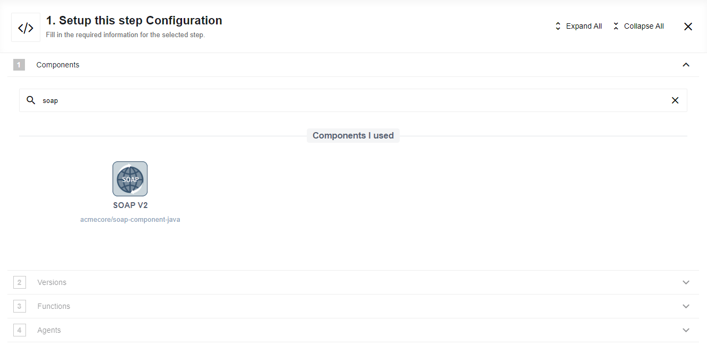
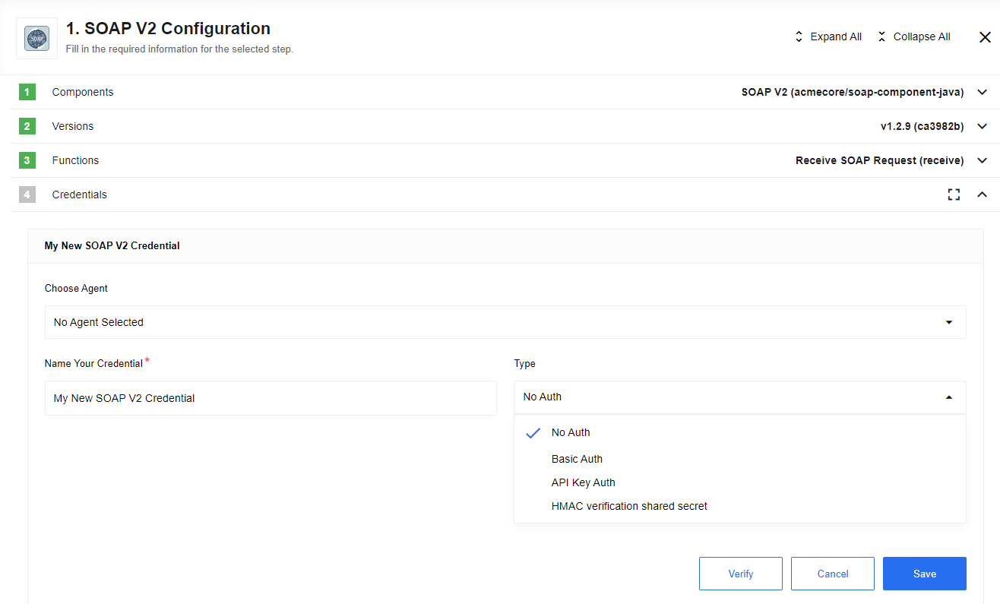

## Description

The SOAP Component provides the SOAP Web Services work opportunity within a
{{site.data.tenant.name}} flow. As an integration platform, {{site.data.tenant.name}} has an opportunity to
invoke SOAP Web services over HTTP.

## Requirements

The platform supports the following SOAP protocol versions:
*   SOAP 1.1
*   SOAP 1.2

Component supports the following WSDL styles:

*   RPC/Literal
*   Document/Encoded
*   Document/Literal

### Environment variables

` EIO_REQUIRED_RAM_MB - recommended value of allocated memory is 2048MB 2048MB`

### Credentials

#### Type

You can select the following authorization type:

*   **No Auth**
*   **Basic Auth**
    *   **Username** - Username for Basic authorization header in the SOAP request
    *   **Password** - Password for Basic authorization header in the SOAP request
*   **API Key Auth** (*not supported yet*).

>**Please note:** Error would not be thrown on invalid credentials, as credenteals does not contain WSDL url.
In case of invalid credentials error expected on sample retrieve step: Unexprected reponse from server satus code: 401 Anunthorized

### Technical Notes

The [technical notes](technical-notes) page gives some technical details about SOAP component like [changelog](/components/soap/technical-notes#changelog) and [completeness matrix](/components/soap/technical-notes#completeness-matrix).

## How it works

### Step 1

Find and select SOAP component in the component repository:

### Step 2

Create new or select existing credentials:

### Step 3

Specify WSDL URL, then choose binding and operation consecutively. **The order matters!** Then configure an input data and click "Continue":

### Step 4

Retrieve sample or add sample manually:

### Step 5

Retrieve sample result:

## Triggers

  1. [Receive SOAP Request](/components/soap/triggers#receive-soap-request)                                                 
  Webhook that validates input body over WSDL.

## Actions

  1. [Call](/components/soap/actions#call)                                                                                    
  Makes a call to SOAP service over HTTP using public WSDL URL.

  2. [Soap Reply](/components/soap/actions#soap-reply)                                                                        
  Wraps and returns input data as SOAP response by provided SOAP metadata.

## Known limitations

Here are the limitations of this component:

*   RPC/SOAP-Encoded styles are not supported.
    *   **All major frameworks for web services support Document/literal messages. Most of the popular frameworks also have some support for rpc/encoded, so developers can still use it to create encoded-only services.** As a result it is hard to estimate the number of web services, in production use, work only with SOAP encoded messages. However, there is a tendency to move away from RPC/encoded towards Document/literal. Since the SOAP encoding specification does not guarantee 100% inter-operability and there are vendor deviations in the implementation of RPC/encoded.
*  Only self-containing WSDLs are supported now. This means that WSDL containing external XSD schemas will not work in this version of the component.
*  WS-Security header is not supported.
*  WS-Addressing is not supported.
*  Custom SOAP headers can not be added.
*  The WSDL and associated schemas must be accessible via a publicly accessible URL. File upload of the WSDL and/or XSD schemas is not supported.
*  Component does not support multi-part format of message in the SOAP request element. Only first part of request element will be processed in the current component version.
* 'Emit SOAP Faults Instead of Throwing an Error' feature of the 'CallAction' action was not fully tested against all the possible SOAP faults.

## API and Documentation links

*   [Apache Axis2](http://axis.apache.org/axis2/java/core/)
*   [FasterXML JsonSchemaGenerator](https://github.com/FasterXML/jackson-module-jsonSchema)
