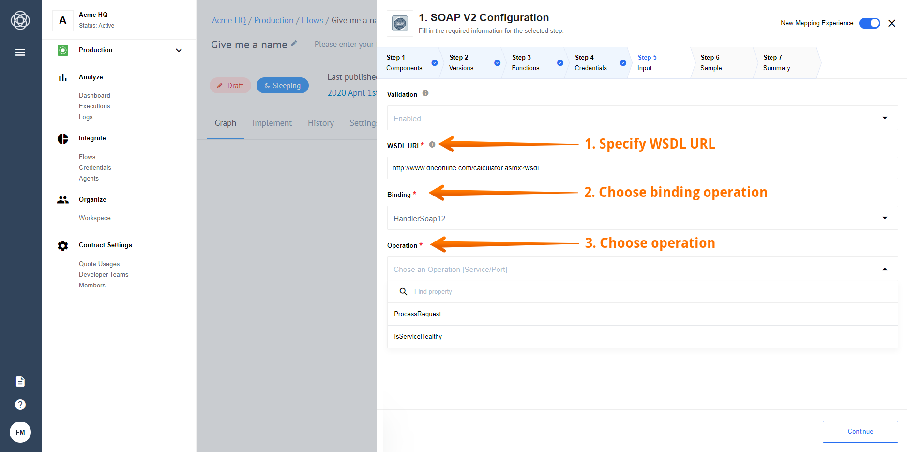

## Receive SOAP Request

Webhook that validates input body over WSDL:



### Input fields description

*   **WSDL URI** - Public URL address of the WSDL
*   **Binding** - One of the bindings available and described in the WSDL, which you want to use for a SOAP call
*   **Operation** - One of the operations available for the binding you have selected above.
*   **Validation** - If `Enabled` validate the SOAP Body over WSDL, if `Disabled` does not validate a SOAP Input Body

### Example of usage

#### Configuration:

*   **WSDL URI** - `http://www.dneonline.com/calculator.asmx?wsdl`
*   **Binding** - `CalculatorSoap12`
*   **Operation** - `Add`
*   **Validation** - `Enabled`

#### Request Body:

```xml
<soap:Envelope xmlns:xsi="http://www.w3.org/2001/XMLSchema-instance" xmlns:xsd="http://www.w3.org/2001/XMLSchema" xmlns:soap="http://schemas.xmlsoap.org/soap/envelope/">
  <soap:Body>
    <Add xmlns="http://tempuri.org/">
      <intA>1</intA>
      <intB>1</intB>
    </Add>
  </soap:Body>
</soap:Envelope>
```

#### Output:

```json
{
  "Add": {
    "intA": "1",
    "intB": "1"
  }
}
```

### Current Limitations

1. Namespaces ignored and SOAP Body with 2 tags that have the same name but in different namespaces would be invalid
2. SOAP Headers not supported yet
3. Retrieve Sample does not represent actual behaviour of component
