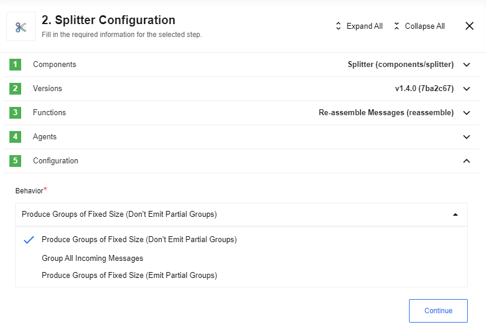

## Split on JSONata Expression

This action takes the incoming message body and applies the configured JSONata transformation on it. The evaluated transformation must be an array. This array is split and emitted into multiple messages.

For example, given the following message:

```json
{
    "FirstName": "Fred",
    "Surname": "Smith",
    "Phone": [
        {
            "type": "home",
            "number": "0203 544 1234"
        },
        {
            "type": "office",
            "number": "01962 001234"
        },
        {
            "type": "mobile",
            "number": "077 7700 1234"
        }
    ]
}
```

and the JSONata expression `Phone.{type: number}`, an object constructor, the
action will return output:


>**Please note:** If the evaluated array contains primitive values like ```users:["John", "Mike", "Anna"]```, the splitter emits error.

### List of Expected Config fields

`Split Property` - use this field to choose a separator.

## Re-assemble Messages

Inverse of the split action: Given a stream of incoming messages that which have
been split apart by a split action (or similar), produce one message once all
message parts have arrived:


*  `Unique ID to describe the group` is actualy a `groupId` - Globally unique id for the group to distinguish it from other groups. This value needs to be the same for all messages in a group.
*  `Unique ID to describe this message` is actualy a `messageId` - Must be unique per group but does not have to be globally unique. This value needs to be different for all messages in a group. In case a messageId occures multiple times, only the messageData of the latest message survives. If the messageId is not defined, a random guid will be generated and used as messageID.
*  `messageData` - Data from individual messages can be inserted here in form of an object. This object is then inserted into an array which is available in the message emitted for this group.
*  `Number of Messages prodused by splitter` is actualy a `groupSize` - Number of messages in the group. Is required in `Produce Groups of Fixed Size` behaviour.
*  `Delay timer (in ms)` - Time the process waits when no incoming messages before emiting (Max 40,000 milliseconds)

### List of Expected Config fields

`Behavior` - Has 3 different behaviour variants(options):



* `Produce Groups of Fixed Size (Don't Emit Partial Groups)`: A message is emitted once the group size is reached for the given group. If arriving messages for a particular group are less than the defined group size then the group will **not be emitted**.
* `Group All Incoming Messages`: All incoming messages will be gathered until there are no more incoming messages in the specifeid timeframe (delay timer) at which point messages will be emitted for each group.
* `Produce Groups of Fixed Size (Emit Partial Groups)`: Specify both `groupSize` and `Delay timer`. Once a group is complete, that group will be emitted. Once there are no more incoming messages, then partially completed groups will also be emitted.

### Supported

* Messages can be re-ordered in the flow
* If messages are re-delivered as a result of the platform's at once delivery guarantee, does not trigger false positives
* Messages from one original message can be interleaved with messages from another original message
(e.g. Two overlapping webhook calls arrive and the flow has components where parallel processing > 1.)

### Limitations

* All groups must have one or more messages. (i.e. No groups of size 0).
Can't do re-grouping when a split is done on an empty array. (i.e. No empty for each pattern supported).
If all the messages in the group do not arrive, then the group will not be emitted.
* The group is dropped if there are any unexpected restarts to the container.
* In case only a groupSize is given and no delay timer is specified. The size of the group must be known by all group members.
* In case of using the delay timer. Messages are only emitted when all parts arrive. Emitting a message only when the first part arrives isn't supported.
* The delay timer can not exceed 20,000 milliseconds. If more than this maximum is given, then this maximum will be used instead.

## Split Message By Array(deprecated)

**This action is deprecated, please use Split on JSONata Expression instead.**

Splits a message into multiple messages using a given separator. The separator is treated as a path to a property inside the message. A message is split when a property is an array and emitted are multiple messages. Otherwise the original message is emitted.

For example, we have a message:

```json
{
    "users": [
        {
            "name": "John"
        },
        {
            "name": "Mike"
        }
    ]
}
```

The splitting expression is "users", action will return output:

```json
{
    "name": "John"
}

{
    "name": "Mike"
}
```

>**Notes:**
- *When splitting expression refers to an object splitter returns this object;*
- *When splitting expression contains primitive value like ```users:"John"``` or array of primitives like ```users:["John", "Mike", "Anna"]``` splitter emits error.*
