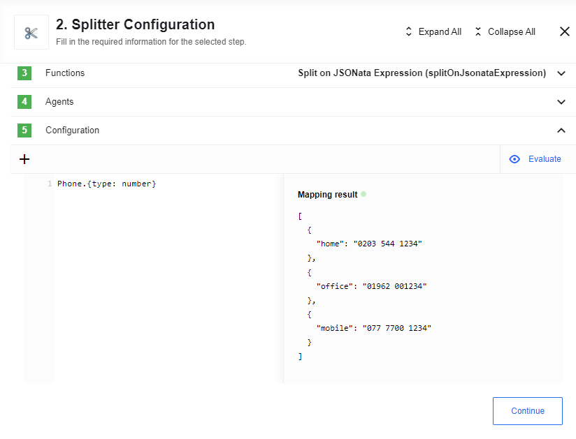

## Latest changelog

**1.1.5 (September 25, 2020)**

* Component code audit

> To see the full **changelog** please use the following [link](changelog).

## Description

The Splitter processes income messages containing multiple elements that might have to be processed in different ways. The Splitter emits out the composite message into individual messages, each containing data related to one item.

### Environment variables

Component does not have any required environment variables, but we suggest to use `EIO_REQUIRED_RAM_MB` in order to avoid `Component run out of memory and terminated` error, recommended value of allocated memory is `512` MB.

For debugging purposes there is: `LOG_LEVEL` - `trace` | `debug` | `info` | `warning` | `error` that controls logger level.

## Triggers

This component has no trigger functions. This means it will not be accessible to
select as a first component during the integration flow design.

## Actions

### Split Message By Array

**This action is deprecated, please use Split on JSONata Expression instead.**

Splits a message into multiple messages using a given separator. The separator is treated as a path to a property inside the message. A message is split when a property is an array and emitted are multiple messages. Otherwise the original message is emitted.

For example, we have a message:

```json
{
    "users": [
        {
            "name": "John"
        },
        {
            "name": "Mike"
        }
    ]
}
```

The splitting expression is "users", action will return output:

```json
{
    "name": "John"
}

{
    "name": "Mike"
}
```

>**Notes:**
- *When splitting expression refers to an object splitter returns this object;*
- *When splitting expression contains primitive value like ```users:"John"``` or array of primitives like ```users:["John", "Mike", "Anna"]``` splitter emits error.*

### Split on JSONata Expression

This component takes the incoming message body and applies the configured JSONata tranformation on it. The evaluated transformation must be an array. This array is split and emitted into multiple messages.

For example, given the following message:

```json
{
    "FirstName": "Fred",
    "Surname": "Smith",
    "Phone": [
        {
            "type": "home",
            "number": "0203 544 1234"
        },
        {
            "type": "office",
            "number": "01962 001234"
        },
        {
            "type": "mobile",
            "number": "077 7700 1234"
        }
    ]
}
```

and the JSONata expression `Phone.{type: number}`, an object constructor, the
action will return output:



>**Please note:** If the evaluated array contains primitive values like ```users:["John", "Mike", "Anna"]```, the splitter emits error.

### List of Expected Config fields

`Split Property` - use this field to choose a separator.

### Re-assemble Messages

Inverse of the split action: Given a stream of incoming messages that which have
been split apart by a split action (or similar), produce one message once all
message parts have arrived:


#### Supported

* Messages can be re-ordered in the flow
* If messages are re-delivered as a result of the platform's at once delivery guarantee, does not trigger false positives
* Messages from one original message can be interleaved with messages from another original message
(e.g. Two overlapping webhook calls arrive and the flow has components where parallel processing > 1.)

#### Limitations

* All groups must have one or more messages. (i.e. No groups of size 0).
Can't do re-grouping when a split is done on an empty array. (i.e. No empty for each pattern supported)
* If all messages in a group fail to arrive at the re-assemble action (because one message suffered an error earlier in the flow)
then this component will silently discard the group.
* All messages must arrive within the same container lifetime.  
If at any point there is more than a 15 second gap in messages, then the group will be silently discarded.  
* The group is dropped if there are any unexpected restarts to the container.
* Size of the group must be known by all group members.
* Messages are only emitter when all parts arrive. Emitting a message only when the first part arrives isn't supported.
* The contents of data that are picked up by the sub-messages aren't passed forward to future steps.

#### List of Expected Config fields

`groupSize` - Number of messages in the group

`groupId` - Globally unique id for the group to distinguish it from other groups. This value needs to be the same for all messages in a group.

`messageId` - Id for a message to distinguish it from other messages in the group.

Must be unique per group but does not have to be globally unique. This value needs to be different for all messages in a group.
