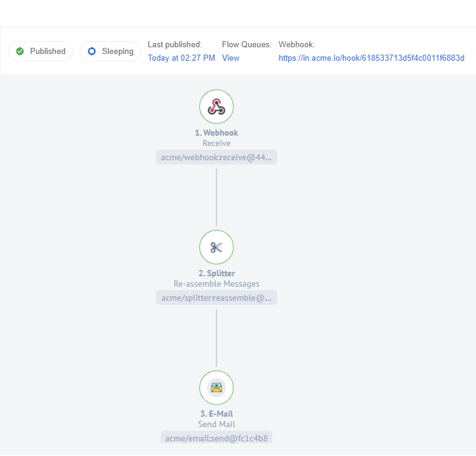

## Flow example

We want to show you the simplest example of using Re-Assemble action. In this example, you will see the simplest scenario, in which the functionality of the Splitter component is best understood. Our task will be to receive messages, in this case we will receive them from a Webhook component, and then accumulate and re-assemble them using Splitter. What to do with the merged data is up to you, but in our case we will just send it via email. Thus, the entire Fellowship of the Ring will be assembled once again. To do this, we will use this flow:



With the help of the Webhook component, we will send several messages that will be collected using a Splitter component and, after the 20 seconds specified in the `Delay timer`, Re-assemble all these messages into one single array. We will later send this array using the E-mail component.  Here you can see an example of message:


In the Splitter-Step we use a behavior `Group All Incoming Messages` to wait for all our messages exactly as long as indicated in `Delay timer`. Next, you need to fill in the required fields as follows:

* `Unique ID to describe the group` - group_id

* `Unique ID to describe this message` - message_id

* `Message Data` - message

{% include img.html max-width="80%" url="img/splitter-re-assemble-input.png" title="Input" %}

As a final step, we will simply specify all our data in the E-mail component. It is important to note that our array needs to be turned into a readable object. We can do this with the `$string()` function:

```
 $string($getPassthrough()."step_6".body.messageData)
```
> `body.messageData` is the output of the Splitter component.

{% include img.html max-width="80%" url="img/email.png" title="Email" %}


After that, we will receive the following E-Mail, which will contain the array we need:

Our Array:

```
{"f1":"Gandalf the Grey",f2":"Frodo","f3":"Sam","f4":"Merry","f5":"Pippin","f6":"Aragorn","f7":"Boromir","f8":"Legolas","f9":"Gimli"}
```

{% include img.html max-width="80%" url="img/message.png" title="Message" %}

You can see that the our group_id and the group_size were in the subject, and the message contains the array itself.
