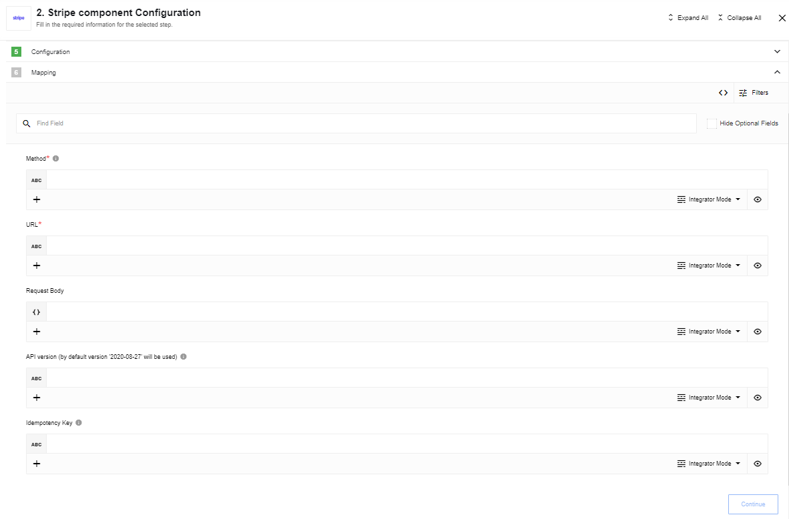

## Environment variables
|Name|Mandatory|Description|Values|
|----|---------|-----------|------|
|`API_RETRIES_COUNT`| false | Set how many time system try to make request to API on errors (3 by default) | any `integer` above 0|
|`API_RETRY_DELAY`| false | Delay between retry attempts in milliseconds (10000 by default) | any `integer` above 0|
|`API_REQUEST_TIMEOUT`| false | HTTP requests timeout in milliseconds (15000 by default) | any `integer` above 0|

## Credentials

Component credentials configuration fields:

* **API Key**  (string, required) - Stripe [Secret Key](https://dashboard.stripe.com/apikeys). [Documentation](https://stripe.com/docs/keys) for Stripe API Keys.

To verify credentials request `GET https://api.stripe.com/v1/charges` with your Secret Key is used. So if you are restricted to make this API call - simply skip credentials verification.

## Triggers

This component has no trigger functions. This means it will not be accessible to
select as a first component during the integration flow design.

## Actions

### Make Raw Request

Executes custom request.

#### Configuration Fields

* **Don't throw error on 404 or 402 Response** - (optional, boolean): Treat 404 and 402 HTTP responses not as error, defaults to `false`.

#### Input Metadata

* **Url** - (string, required): Path of the resource relative to `https://api.stripe.com`.
* **Method** - (string, required): HTTP verb to use in the request, one of `GET`, `POST`, `PUT`, `PATCH`, `DELETE`.
* **Request Body** - (object, optional): Body of the request to send.
* **API Version** - (string, optional): API version (by default version '2020-08-27' will be used). Stripe [versioning](https://stripe.com/docs/api/versioning). Stripe [API-changelog](https://stripe.com/docs/upgrades#api-changelog).
* **Idempotency Key** - (string, optional): Unique value which the server uses to recognize subsequent retries of the same request ([UUID](https://wikipedia.org/wiki/Universally_unique_identifier) is recommended). Stripe [Idempotent requests](https://stripe.com/docs/api/idempotent_requests).

#### Output Metadata

* **Status Code** - (number, required): HTTP status code of the response.
* **HTTP headers** - (object, required): HTTP headers of the response.
* **Response Body** - (object, optional): HTTP response body.
