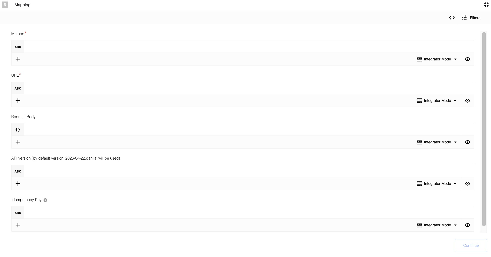
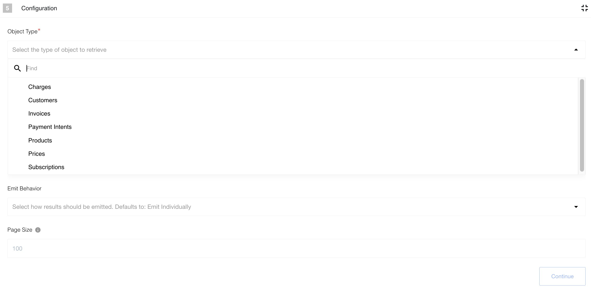
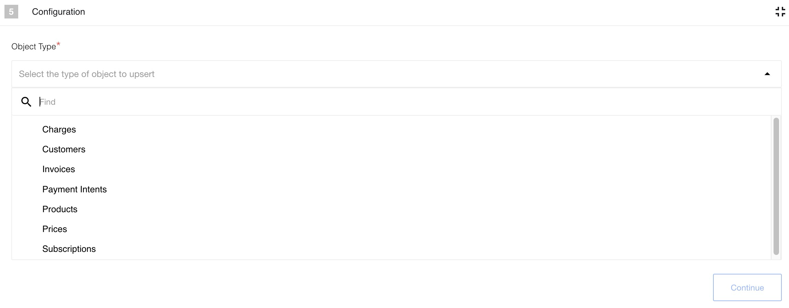

## Table of Contents

* [Description](#description)
  * [API Versioning](#api-versioning)
  * [Important Notes on Currency and Amounts](#important-notes-on-currency-and-amounts)
* [Environment Variables](#environment-variables)
* [Credentials](#credentials)
* [Actions](#actions)
  * [Make Raw Request](#make-raw-request)
  * [Lookup Objects (Plural)](#lookup-objects-plural)
  * [Upsert Object](#upsert-object)
* [Triggers](#triggers)

## Description

The Stripe component is designed for seamless integration with the [Stripe API](https://stripe.com/docs/api).

### API Versioning

For the **Make Raw Request** action, users can specify a preferred Stripe API version (e.g., `2022-11-15`) within the input metadata. If left blank, it defaults to version `2026-04-22.dahlia`. Other actions (like *Upsert* or *Lookup*) use the default API version configured in your Stripe account dashboard.

### Important Notes on Currency and Amounts

#### Smallest Currency Unit (Cents)

All amount fields in this component (e.g., `unit_amount`, `balance`, `application_fee_amount`) expect values in the **smallest currency unit**. 
- For **EUR**, **USD**, and most other currencies, this means **cents**.
- **Example**: To set an amount of **10.50 EUR**, you must provide **`1050`**. Providing `10.5` or `10` will result in incorrect amounts (0.10 EUR or 0.10 EUR depending on the field).

#### Customer Balance Sign Convention

When working with the `balance` field in the **Customer** object:
- **Positive (+) Values**: Represent a **debit** (the customer owes you money). This increases the amount due on the customer's next invoice.
- **Negative (-) Values**: Represent a **credit** (you owe the customer money). This decreases the amount due on the customer's next invoice.
- **Example**: To give a customer a credit of **5.00 EUR**, use **`-500`**.

## Environment variables

| Name                  |Mandatory|Description|Values|
|-----------------------|---------|-----------|------|
| `API_RETRIES_COUNT`   | No | Number of retry attempts for failed API requests (Default: 3). | Positive integer|
| `API_RETRY_DELAY`     | No | Delay between retry attempts in milliseconds (Default: 10000). | Positive integer|
| `API_REQUEST_TIMEOUT` | No | Timeout duration for HTTP requests in milliseconds (Default: 15000). | Positive integer|

## Credentials

The component requires the following configuration:
* **API Key** (string, required): Your Stripe [Secret Key](https://dashboard.stripe.com/apikeys). For more information, refer to the [Stripe API Key documentation](https://stripe.com/docs/keys).

To verify credentials request `GET https://api.stripe.com/v1/charges` with your Secret Key is used. So if you are restricted to make this API call - simply skip credentials verification.

## Actions

### Make Raw Request

Executes a custom HTTP request against the Stripe API.

#### Configuration Fields

* **Don't throw error on 404 or 402 Response**: (optional, boolean): If enabled, 404 (Not Found) and 402 (Request Failed) responses will be treated as successful operations rather than errors. Defaults to `false`.

#### Input Metadata



* **Method**: (string, required): The HTTP verb to use (`GET`, `POST`, `PUT`, `PATCH`, `DELETE`).
* **URL**: (string, required): The resource path relative to `https://api.stripe.com`.
* **Request Body**: (object, optional): The payload to be sent with the request.
* **API Version**: (string, optional): The specific Stripe API version to use (Defaults to `2026-04-22.dahlia`). Refer to Stripe's [versioning](https://stripe.com/docs/api/versioning) and [API changelog](https://stripe.com/docs/upgrades#api-changelog) for details.
* **Idempotency Key**: (string, optional): A unique identifier used by Stripe to recognize retries of the same request, preventing duplicate operations. A [UUID](https://wikipedia.org/wiki/Universally_unique_identifier) is recommended. See Stripe's [Idempotent Requests](https://stripe.com/docs/api/idempotent_requests) for more information.

#### Output Metadata

* **Status Code**: (number, required): The HTTP status code returned by the server.
* **HTTP Headers**: (object, required): The response headers.
* **Response Body**: (object, optional): The JSON payload returned by the server.


#### Usage Example

As of the component version 1.1.0, the request body can be provided as a standard JSON object. This is a significant improvement over version 1.0.0, which only supported `application/x-www-form-urlencoded` formatting.

As an example we'll be using the [Payment Links](https://stripe.com/docs/api/payment_links/payment_links/create) endpoint.

##### **Version 1.1.0 (Recommended)**
You can now use a clean JSON structure:

```json
{
  "method": "POST",
  "url": "v1/payment_links",
  "data": {
    "line_items": [
      {
        "quantity": 3,
        "price": "price_1MJXtjGB4S5N5BY8ymGY6TWC"
      }
    ]
  }
}
```

##### **Version 1.0.0 (Legacy Support)**
The legacy form-encoded style remains supported for backward compatibility:

```json
{
  "method": "POST",
  "url": "v1/payment_links",
  "data": {
      "line_items[][quantity]": 3,
      "line_items[][price]": "price_1MJXtjGB4S5N5BY8ymGY6TWC"
    }
}
```

### Lookup Objects (plural)

Retrieves a collection of objects based on specified criteria using Stripe's [Search API](https://stripe.com/docs/search).

To refine your search, construct a query using the [Stripe Search Query Language](https://stripe.com/docs/search#search-query-language).

> **Please Note:** When configuring queries on the platform, use single quotes (`''`) instead of double quotes (`""`).

#### Query Examples:
1. `name:'Joe' AND -phone:'000'`: Finds objects named 'Joe' that do **not** have the phone number '000'.
2. `amount>100 OR status:'succeeded'`: Finds objects with an amount greater than 100 **or** a status of 'succeeded'.

#### Configuration Fields



* **Object Type**: (dropdown, required): The type of object to retrieve. Supported types:
  * Charges
  * Customers
  * Invoices
  * PaymentIntents
  * Prices
  * Products
  * Subscriptions
* **Emit Behavior**: (dropdown, required): Determines how the results are processed: `Emit all`, `Emit page`, or `Emit individually`.
* **Page Size**: (number, default: 100, max: 100): The number of records to fetch per API request.

#### Input Metadata

* **Query**: (string, required): The search query string.

#### Output Metadata

* **Emit All / Emit Page**: Returns an object with a `results` key containing an array of objects.
* **Emit Individually**: Emits each object as a separate message.

### Upsert Object

Creates a new object or updates an existing one if an ID is provided.

#### Configuration Fields



* **Object Type**: (dropdown, required): The type of object to upsert. Supported types:
  * Charges
  * Customers
  * Invoices
  * PaymentIntents
  * Prices
  * Products
  * Subscriptions

#### Input Metadata

* **ID**: (string, optional): If provided, updates the existing object. If omitted, creates a new one.
* **Metadata**: (array of objects, optional): Set of custom key-value pairs that you can attach to an object. Each object should have `key` and `value` properties. **Note:** Keys must be unique; if duplicate keys are provided, the last one will overwrite the previous ones.
* **Other fields**: Depends on the selected **Object Type**.

#### Usage Examples

##### **Create a New Customer**
To create a new customer with custom metadata:

```json
{
  "name": "John Doe",
  "email": "john.doe@example.com",
  "description": "Premium subscriber",
  "metadata": [
    { "key": "internal_id", "value": "ID-9988" },
    { "key": "marketing_source", "value": "Google Ads" }
  ]
}
```

##### **Update an Existing Customer**
To update an existing customer by providing their Stripe ID:

```json
{
  "id": "cus_Rlgm7L8v8G5N5B",
  "description": "Updated description",
  "metadata": [
    { "key": "status", "value": "verified" }
  ]
}
```

#### Output Metadata

* **JSON Body**: The complete JSON response from Stripe after the create or update operation.

## Triggers

This component has no trigger functions. This means it will not be accessible to
select as a first component during the integration flow design.