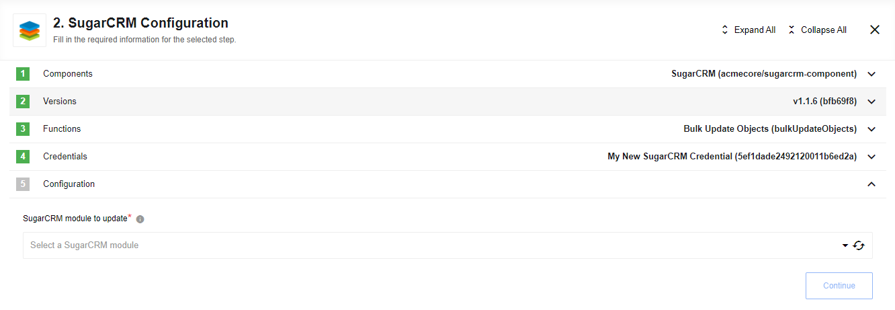
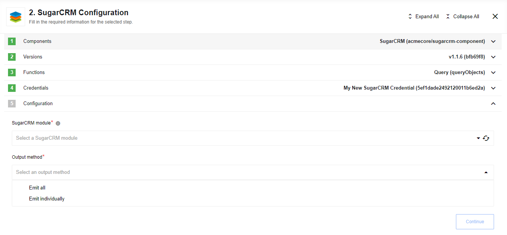

## Lookup Object By ID

Given an object, looks up the object with that ID. You must select the type of
object to lookup.


### Input field description

* **SugarCRM module to lookup** - dropdown list where you should choose the module, which you want to lookup. E.g. `Accounts`.

* **Pass binary data to the next component (if found object has it)** - a checkbox, if it is checked and found object has a binary field (type of `file`) then its data will be passed to the next component as a binary attachment.

## Lookup Objects

Lookup a list of objects satisfying specified criteria.


### Input field description

* **SugarCRM module to lookup** - dropdown list where you should choose the module, which you want to lookup. E.g. `Accounts`.

* **Output method** - dropdown list with following values: `Emit all`, `Emit page`, `Emit individually`.

* **Number of search terms** - text field where you can specify a number of search terms (not less than 0 and not greater than 99). Default value is 0 (if provided value is not allowed).

### Metadata description

Depending on the configuration field *Output method* the input metadata can contain different fields:

*Output method* - `Emit page`:

Field `Page size` - required positive integer that defaults to 1000;

Field `Page number` - required non-negative integer (starts with 0, default value 0);

*Output method* - `Emit all`:
Field "Maximum number of records" - optional positive integer (default value 1000);

*Output method* - `Emit individually`:
Field `Maximum number of records` - optional positive integer (default value 10000);

>**Please note** that the number of records the component emits may affect the performance of the platform/component.

Groups of fields for each search term go next:

Field `Field name` - string represents module's field (a list of allowed values is available);

Field `Field value` - string represents value for selected field;

Field `Condition` - one of the following: `=`, `!=`, `<`, `<=`, `>`, `>=`, `STARTS WITH`, `ENDS WITH`, `CONTAINS`, `IS NULL`, `NOT NULL`, `IN`, `NOT IN`;

Between each two term's group of fields:

Field `Logical operator` - one of the following: `AND`, `OR`;

Output data depends on the configuration field *Output method*:

* `Emit page`, `Emit all` - an array of records;
* `Emit individually` - a record;

## Delete Object By ID

Given an object, deletes the object with that ID.  You must select the type of
object to lookup.


## Upsert Object By ID

Update an existing entry if the id provided. Otherwise create a new entry. You must select the type of object to lookup.
Input metadata is fetched dynamically from your SugarCRM account. Output metadata is the same as input metadata, so you may expect all fields that you mapped as input to be returned as output.


### Input fields description

* **Module** - Input field where you should choose the object type, which you want to find. E.g. `Note`

* **Utilize data attachment from previous step (for objects with a binary field)** - a checkbox, if it is checked and an input message contains an attachment and specified object has a binary field (type of `file`) then the attachment is put into object's binary field.

### Limitations

When **Utilize data attachment from previous step (for objects with a binary field)** is checked and this action is used with Local Agent error would be thrown: 'getaddrinfo ENOTFOUND steward-service.platform.svc.cluster.local steward-service.platform.svc.cluster.local:8200'

## Bulk Create Objects

Provides a simple interface for quickly creating large amounts of objects.


### Input field description

* **Module** - dropdown list where you should choose the object type to perform bulk create operation. E.g. `Cases`.

### Metadata description

* **Objects** - an array of the objects that will be created. Example of format [SugarCRM objects](https://support.sugarcrm.com/Documentation/Sugar_Developer/Sugar_Developer_Guide_9.2/Integration/Web_Services/REST_API/Endpoints/module_POST/)

Result is an object with a property **result**: `array`. It contains the list of newly created objects.

## Bulk Update Objects

Provides a simple interface for quickly updating large amounts of objects.



### Input field description

* **Module** - dropdown list where you should choose the object type to perform bulk update operation. E.g. `Cases`.

### Metadata description

* **Massupdate_params** - an object contains `array` of uid's and new values for updated objects. Action allows not only update primitive fields but also add or replace values in the lists. Please, take a look [SugarCRM Mass Update](https://support.sugarcrm.com/Documentation/Sugar_Developer/Sugar_Developer_Guide_9.2/Integration/Web_Services/REST_API/Endpoints/moduleMassUpdate_PUT/) documentation for examples.

Result is an object with the 2 properties:

* **failed** - `numeric`, how many objects were failed to update.

* **status** - `string`, if operation were successful `status="done"`. Operation could consider successful even if `failed > 0`

> **Please note:** SugarCRM server doesn't return errors in case of a wrong uid.

## Bulk Delete Objects

Provides a simple interface for quickly deleting large amounts of objects.


### Input field description

* **Module** - dropdown list where you should choose the object type to perform bulk delete operation. E.g. `Cases`.

### Metadata description

* **Massupdate_params** - an object contains `array` of uid's for deleted objects. Please, take a look [SugarCRM Mass Update](https://support.sugarcrm.com/Documentation/Sugar_Developer/Sugar_Developer_Guide_9.2/Integration/Web_Services/REST_API/Endpoints/moduleMassUpdate_DELETE/) documentation for examples.

Result is an object with the 2 properties:

* **failed** - `numeric`, how many objects were failed to delete.

* **status** - `string`, if operation were successful `status="done"`. Operation could consider successful even if `failed > 0`

## Query

Retrieve a set of records filtered by an expression utilizing the SugarCRM REST API filter endpoint. [See for details](https://support.sugarcrm.com/Documentation/Sugar_Developer/Sugar_Developer_Guide_9.1/Integration/Web_Services/REST_API/Endpoints/modulefilter_POST/)



### Input field description

* **SugarCRM module** - dropdown list where you should choose the module, which you want to lookup. E.g. `Accounts`.

* **Output method** - dropdown list with following values: `Emit all`, `Emit individually`.

### Metadata description

In the Intergator mode a request can be built by filling the following fields:

* **Filter expression** - JSON object representing the filter expression. E.g.

```json
  [
    {
      "billing_address_country":
      {
        "$in": ["England","France"]
      }
    }
  ]
```

* **Maximum number of records** - maximum number of records to return. Default is 20.

* **The number of records to skip** - number of records to skip over before records are returned. Default is 0.

* **How to sort the returned records** - how to sort the returned records, in a comma delimited list with the direction appended to the column name after a colon.

E.g. "name:DESC,account_type:DESC,date_modified:ASC".

In the Developer mode a request can be built utilizing all features by providing a JSON object (for more information go to the link above). E.g.:

```json
{
  "filter": [{
    "$or": [{
        "$and": [{
            "billing_address_country": {
              "$not_in": ["DE", "India"]
            }
          },
          {
            "acc_float_c": {
              "$is_null": ""
            }
          }
        ]
      },
      {
        "billing_address_country": {
          "$equals": "England"
        }
      }
    ]
  }],
  "fields": "id,name,billing_address_country,parent_name,accdate_c,acccheck_c,acc_float_c",
  "max_num": 42
}
```

>**Please note** that the number of records the component emits may affect the performance of the platform/component.

Output data depends on the configuration field **Output method**:

* `Emit all` - an array of records.

* `Emit individually` - a record.
