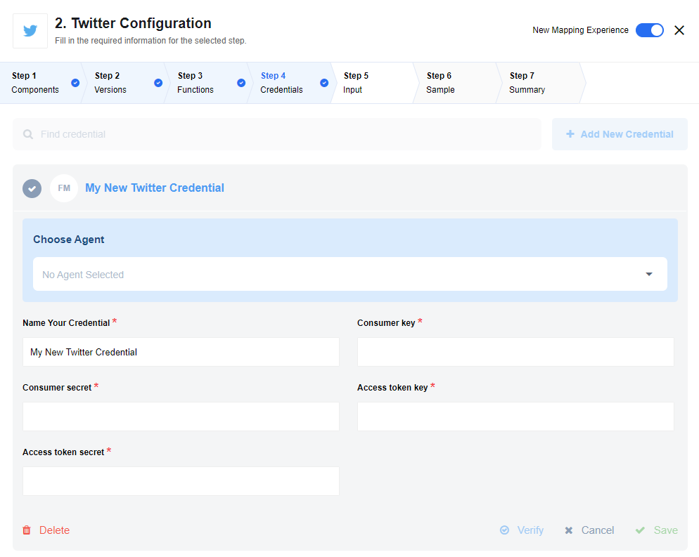
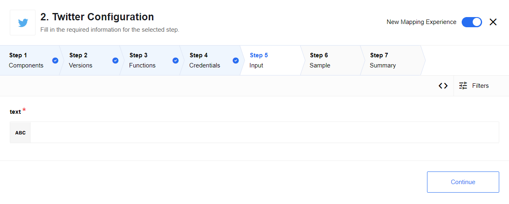
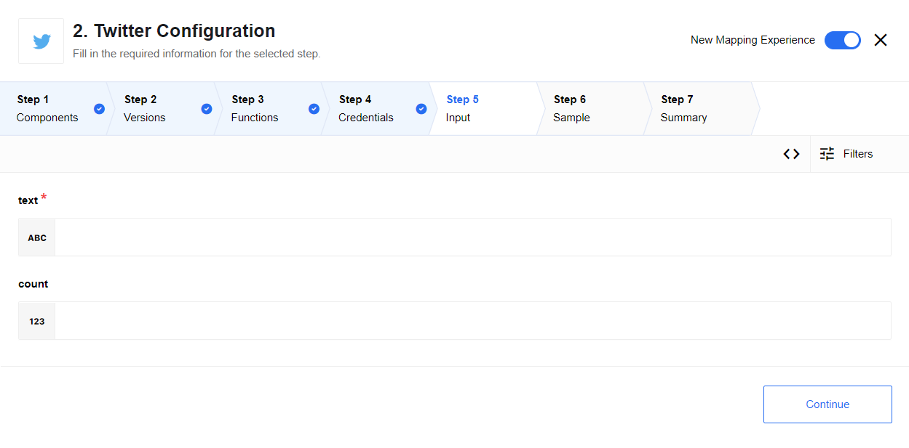

## Credentials



To retrieve credentials you need to create Twitter App and generate token in that app.


## Technical Notes

The [technical notes](technical-notes) page gives some technical details about
Twitter component like [changelog](technical-notes#changelog).

## Triggers

This component has no trigger functions. This means it will not be accessible to
select as a first component during the integration flow design.

## Actions

### Post tweet

in/out metadata can be found at `/lib/schemas/postTweet.{in/out}.json`



#### Usage example

input message:

```json
{
    "text": "hi there"
}
```

output message:

```json
{
    "text": "hi there",
    "id": "979656103867887616",
    "createdAt": "Fri Mar 30 09:46:30 +0000 2018"
}
```

### Search tweets

in/out metadata can be found at `/lib/schemas/searchTweets.{in/out}.json`



#### Usage example

input message:

```json
{
    "text": "hi there",
    "count": 2
}
```

output message:

```json
{
	"tweets": [
		{
            "id": "979656598619607040",
            "userId": "123123",
            "createdAt": "Fri Mar 30 09:48:28 +0000 2018",
            "text": "@user123123 Hi there. If you would like to provide feedback about our packaging, please follow this link:…",
			"lang": "en"
		},
		{
            "id": "979656548753592320",
            "userId": "456456",
            "createdAt": "Fri Mar 30 09:48:17 +0000 2018",
            "text": "@user456456 Hi there, what sort of information can I help you with? Are you looking at train times for today?",
			"lang": "en",
		}
	]
}
```
