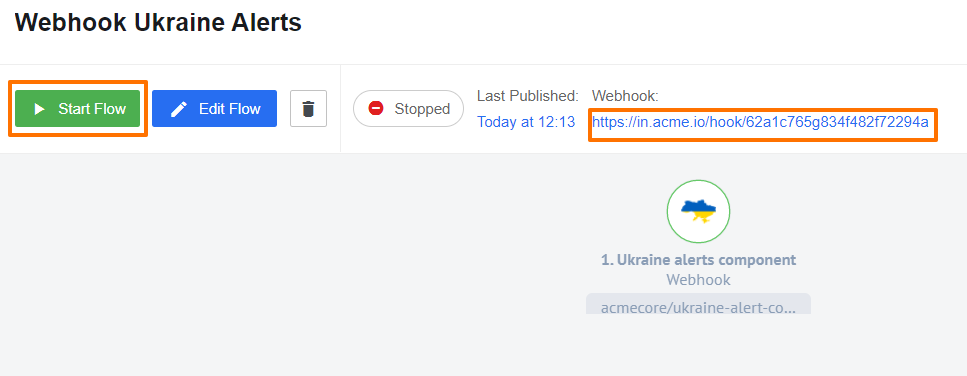

{{page.description}}

## Credentials

No credentials needed.

## Triggers

### Get Ukraine Alerts Polling

Polls for alerts statuses for chosen Ukraine regions.

#### Configuration Fields

* **Regions** - (array, required): Array of selected regions to receive statuses.
* **Emit data if no alerts found** - (checkbox, optional): If checked: when no alerts are found empty array will be emitted. Not checked by default.

#### Input Metadata

There is no Input Metadata.

#### Output Metadata

Array of regions with detailed alerts statuses, schema can be found [here](https://github.com/elasticio/ukraine-alert-component/blob/master/src/schemas/triggers/getUkraineAlertsPolling.out.json)

### Webhook

Subscription for alarms activation and deactivation.

>**Please Note:** To activate subscription you should press `Start Flow` and after flow started - trigger it by pressing on a flow webhook URI:



#### Configuration Fields

* Regions. A multiselect field where you can specify the regions you want to receive alerts about. The component will only emit alerts in these specific regions.

>**Please Note:** Only parent regions are supported for now. This means that is you want to get alerts in a sub-region `1102` you need to choose a parent region `5`.

```json
{
  "regionId": "5",
  "regionName": "Рівненська область",
  "regionType": "State",
  "regionChildIds": [
    {
      "regionId": "110",
      "regionName": "Вараський район",
      "regionType": "District",
      "regionChildIds": [
        {
          "regionId": "1102",
          "regionName": "Антонівська територіальна громада",
          "regionType": "Community"
        }
      ]
    }
  ]
}

```
#### Input metadata

There is no Input Metadata

#### Output Metadata

Received message from subscription.

## Actions

There is no actions in this component.
