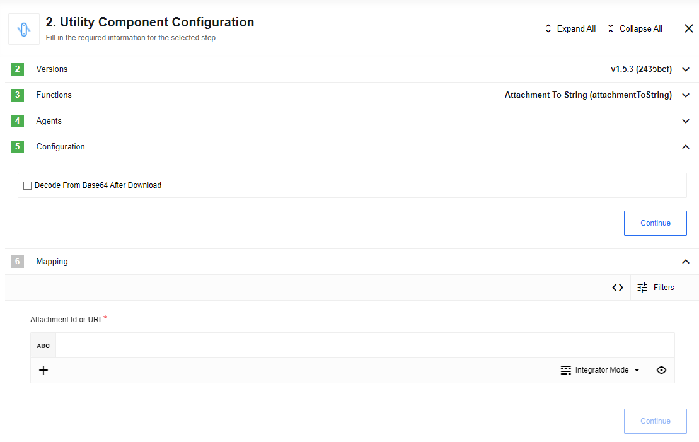
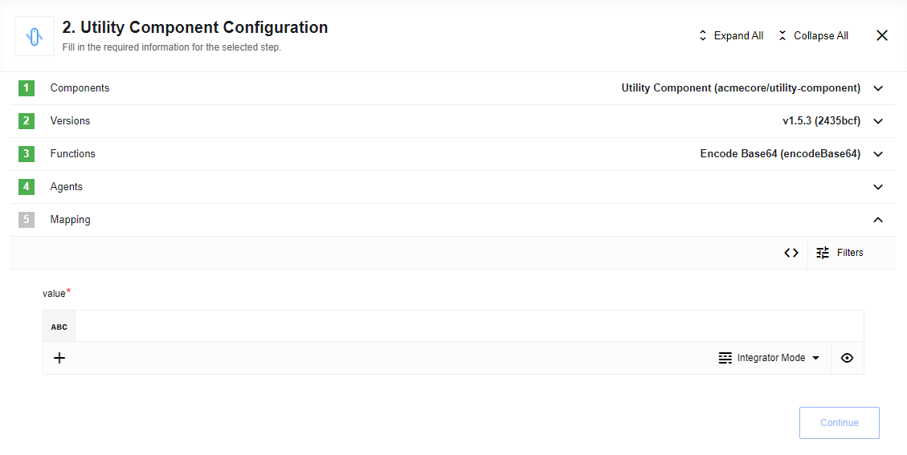
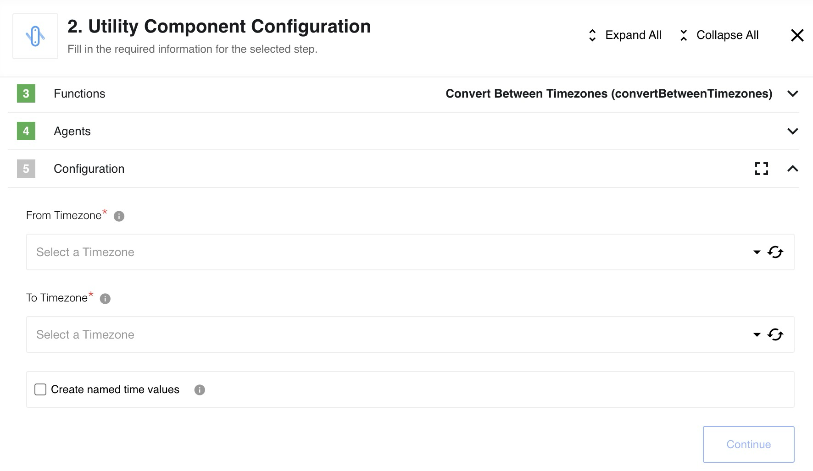

## Environment variables

* [optional] **EIO_REQUIRED_RAM_MB** - Number of MB allocated to container. 1024 by default
* [optional] **REQUEST_TIMEOUT** - HTTP request timeout in milliseconds. 10000 by default
* [optional] **REQUEST_RETRY_DELAY** - Delay between retry attempts in milliseconds. 7000 by default
* [optional] **REQUEST_MAX_RETRY** - Number of HTTP request retry attempts. 7 by default
* [optional] **REQUEST_MAX_CONTENT_LENGTH** - Max size of HTTP request in bytes. 10485760 by default

## Technical Notes

The [technical notes](technical-notes) page gives some technical details about Utility component like [changelog](/components/utility/technical-notes#changelog).

## Triggers

This component has no trigger functions. This means it will not be accessible to
select as a first component during the integration flow design.

## Actions

### String To Attachment

Creates attachment from input `value`. Output is `attachmentId` and `attachmentUrl` in `message.body` and attachment object in `message.attachments`:


#### Configuration fields description

* `encodeToBase64` - if checked encode an input `value` using Base64 encode. Than saves encoded value into attachment.

### String From Attachment

Creates string from attachment with provided input `attachmentId` which must be either:
* A numeric ID of the attachment that can be referenced in the step immediately prior
* A URL to an attachment produced by any component in the flow.



#### Configuration fields description

* `decodeFromBase64` - if checked decode attachment content using Base64 decode before output. If content of attachment is malformed or not Base64 encoded string, result will be malformed.  

### Base64 Decode

Decodes input `value` using Base64 decoding to regular string. If malformed input provided or not Base64 encoded string, result will be malformed:


### Base64 Encode

Encodes input `value` using Base64 encoding:



### Convert Between Timezones

Given two timezones and an array of timestamps (without any timezone info) converts the timestamps to the output timezone. The output is a dictionary of oldTimezone -> newTimezone values:



E.g. If converting from UTC to German time then

`{timesToConvert: ['2020-01-01T12:00:00', '2020-07-01T12:00:00']}`

produces

```
{
  '2020-01-01T12:00:00': '2020-01-01T13:00:00+01:00',
  '2020-07-01T12:00:00': '2020-07-01T14:00:00+02:00',
}
```

This component takes into account that Germany is ahead of UTC 1 hour in Winter and 2 hours in the Summer.
The possible format of incoming strings is deliberately broad to account for as large a range of possible timestamps.
Epoch time conversion is not supported.

### Delay

Introduce a delay before passing the message to the next step.

#### Config Fields

* `Delay behavior`, as two options:

  * `Delay Each` - every incoming message will to delay independent each other, for example: we have 100 messages at the same moment with delay 1 sec, after 1 sec all messages will get to the next step.
  * `Delay All` - all incoming message will to delay one by one, new message will go farther only after previous finish, for example: we have 100 messages at the same moment with delay 1 sec, each second a message will go to the next step (from oldest).

#### Input Metadata

* `Delay Time (in seconds)` - Amount of time this component should wait/delay (in seconds) before emiting the message. Negative number will be converted to positive, strings converted to number, if converted failed will set to zero.
* `Data to transfer` - Use this field to transfer data in to another steps

### Log Message

Log the message (and potentially passthrough) into the provided logger at the selected level.

#### Config Fields

* `Log Level` - dropdown, the log level at which to store the message, default: Info. To see message in logs, level in config must be higher or equal component Log Level. When you do "Retrieve new sample" log Level set to platform default value - Info.
* `Log All Passthrough` - dropdown, Log only the message body or log all passthrough data, default: message body

#### Input Metadata

There are no Input Metadata in this action.

#### Output Metadata

Match the input message metadata

### Create JSON Patch

Utility to create a JSON patch

#### Config Fields

There are no Config Fields in this action.

#### Input Metadata

* `Origin Object` - Object that we have now
* `Target Object` - Object that should be after patch was applied

#### Output Metadata

* `JSON Patch` - Series of changes to be applied to go from Origin Object to Target Object

### Apply JSON Patch

Utility to apply a JSON patch

#### Config Fields

There are no Config Fields in this action.

#### Input Metadata

* `Origin Object` - Object that we have now
* `JSON Patch` - Series of changes to be applied to go from Origin Object to Target Object

#### Output Metadata

* `Target Object` - Object that should be after patch was applied

### Network Diagnostics

Useful to diagnose connectivity issues between an eio pod and some endpoint

#### Config Fields

There is no Config Fields

#### Input Metadata

* `URL` - Full url to the resource. E.g `https://github.com`

#### Output Metadata

* `pingResult` - Result object for `ping`
* `nsLookupResult` - Result object for `NsLookup`
* `sslCertCheckResult` - Result object for `SSL certificate check`

## Limitations

1. Maximal possible size for an attachment is 10 MB.
2. Attachments mechanism does not work with [Local Agent](/guides/vpn-agent) Installation.
3. `Delay All` option from `Delay` don't correctly support `Parallel Processing` option in component more then 1
4. `Delay Each` option from `Delay` in ordinary flow type can handle delay up to 30 sec, if you need more, use real-time type
5. Needs to use `Data to transfer` field for correct transfer data after `Delay` component.
