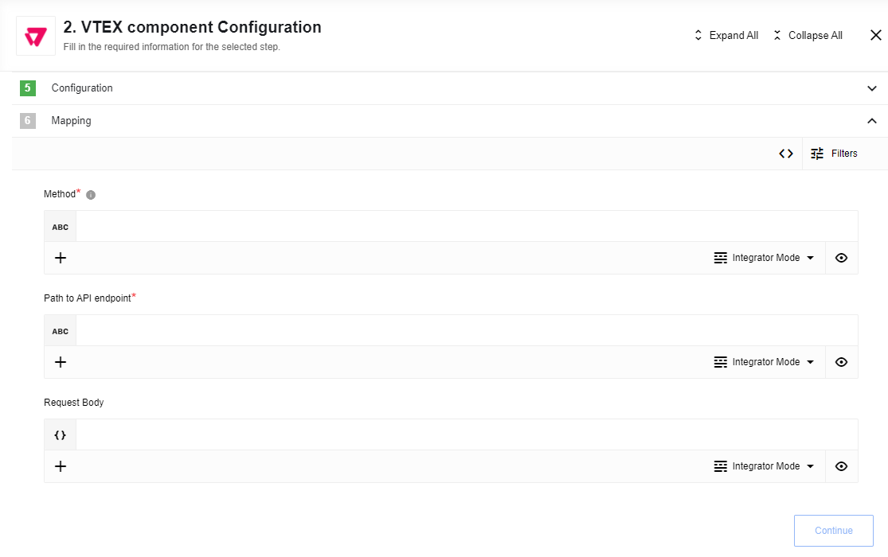
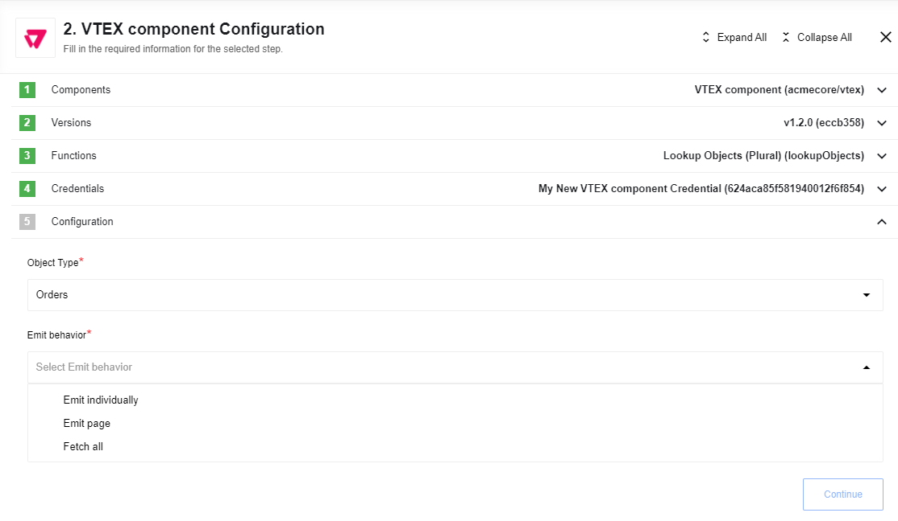
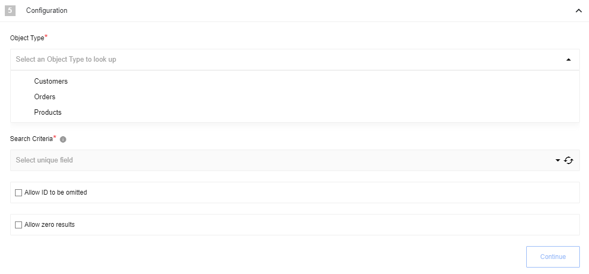
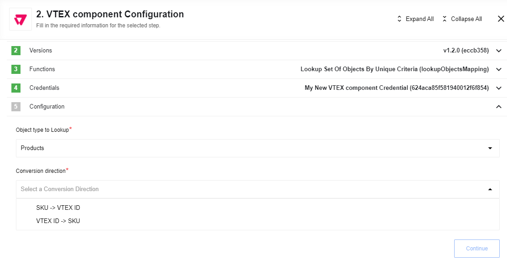
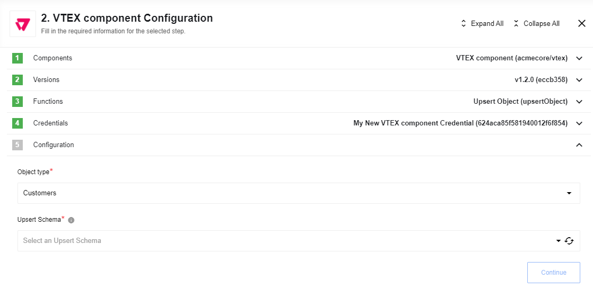
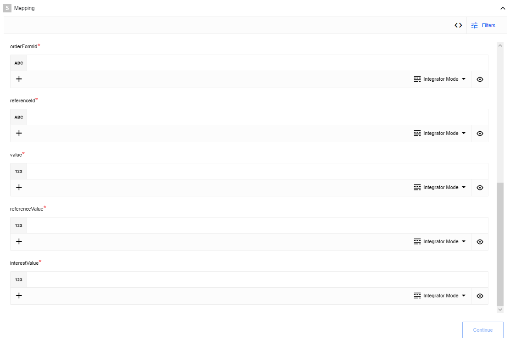

## General information

{{page.description}}

## Credentials

* **App Key*** (string, required) - VTEX AppKey
* **App Token*** (string, required) - VTEX AppToken
* **URL** (string, required) - Base url of your VTEX installation (e.g. `https://bestpartnerbr.myvtex.com/` or `bestpartnerbr`)

>**Please Note:** To generate app keys in your account, you should follow the instructions seen in the [Application Keys article](https://help.vtex.com/en/tutorial/application-keys--2iffYzlvvz4BDMr6WGUtet) in VTEX Help Center.

## Triggers

### Get New And Updated Objects Polling

Polls VTEX API for new and updated objects.

#### Configuration Fields

* **Object Type** - (required, dropdown) currently supported only `Customers` object.
* **Time stamp field to poll on** - (required, dropdown) Indicates just new items, modified or new and modified items: `Created`, `Updated` or `Last interaction`.

#### Limitations

* If you select `Updated` option - only updated objects will be polled, VTEX API fills updatedIn field only if you change object, for created object this field is empty, use `Last interaction` if you need both
* According to [VTEX documentation](https://help.vtex.com/tutorial/querying-the-master-data-via-scroll-path--tutorials_4631) you can execute only one trigger at the same time
* If you make update on object without actually changing it VTEX will not return it

## Actions

### Make Raw Request

Executes custom request

#### Configuration Fields

* **Don't throw error on 404 Response** - (optional, boolean) Treat 404 HTTP responses not as error, defaults to `false`.

#### Input Metadata

* **Url** - (string, required) Path of the resource relative to the base URL.
* **Method** (string, required) - Allowed values `GET`, `POST`, `PUT`, `PATCH`, `DELETE`. HTTP verb to use in the request.
* **Request Body** - (object, optional) Body of the request to send.

#### Output Metadata

* **Status Code** - (number, required) HTTP status code of the response, required.
* **Response Body** - (object, optional) HTTP response body.

### Lookup Objects (Plural)

Provides the possibility to obtain multiple objects from the server by passing in some unique criteria for finding objects and retrieving them.

#### Configuration Fields

* **Object Type**: (dropdown, required). One of `Customers`, `Orders` or `Products`.

>**Please Note:** For now this action supports only `Orders` Object Type.

* **Behavior**: (dropdown, required). Indicates in what manner the action will fetch and retrieve the requested objects. Available options: `Fetch All`, `Fetch Page`, `Emit Individually`.

#### Input Metadata

* **Page Size**: (number, optional). Value between 0 and 30, defaults to 15 - page size used by API. Applicable only in `Fetch Page` mode. A value of 0 indicates that the results will be an empty array with only `totalCountOfMatchingResults` property populated.
* **Page Number**: (number, optional). The number of the page. non-negative, defaults to 0. Used only in `Fetch Page` mode.
* **Order**: (array, optional). Array of strings `OrderField` and `orderType (sort direction)` pairs, separated by coma, defaults to empty array. Can be seen only if it's the `Fetch Page` mode. Array of strings representation: `['OrderField,orderType','OrderField,orderType']`. *Order Field* expected values: creationDate, orderId, items, totalValue and origin. *Order Type* expected values: asc and desc. For example: `['totalValue,desc','creationDate,asc']`.
* **Search Criteria**: (array, optional). `Search terms` to be combined, defaults to empty array. Example: `["fieldName,fieldValue","fieldName,fieldValue"]`.

#### Output Metadata

Depending on the `Behavior` it can be:
- `Fetch Page` mode: An object with key `results` that has an array of object as its value, and key `totalCountOfMatchingResults` which contains the total number of results (not just on the page), which match the search criteria.
- `Fetch All` mode: an object, with key results that has an array as its value.
- `Emit Individually` mode: each object that fills the entire message.

>**Please Note:**  When the user passes search criteria that doesn't match any objects - an empty array inside the object is returned as the results: [], with additional field totalCountOfMatchingResults: 0

### Lookup Object (at Most 1)

Provides the possibility to obtain single object from the server by passing in some unique criteria.

#### Configuration Fields

* **Object Type**: (dropdown, required) - Select object that you want to look up. One of `Customers`, `Orders` or `Products`
* **Search Criteria**: (dropdown, required) - Uniq field that used as search criteria. For customers - Email or VTEX ID, For Orders - VTEX ID, For Products - SKU or VTEX ID
* **Allow ID to be omitted**: (checkbox, optional) - when selected, the ID field becomes optional, otherwise it is a required field
* **Allow zero results**: (checkbox, optional) - when selected, if zero results are returned, the empty object {} is emitted, otherwise an error would be thrown.

#### Input Metadata

* Value of search criteria for selected object type

#### Output Metadata

Selected object that fills the entire message

### Lookup Set Of Objects By Unique Criteria

Action to bulk map product SKUs to VTEX product IDs and backward

>**Please Note:** If no objects found - error will be thrown

#### Input fields description

* **Object type** - a dropdown list where you should choose the object type, which you want to lookup. E.g. `Products`;
* **Conversion direction** - a dropdown list where you should choose direction for conversion: `SKU -> VTEX ID` or `VTEX ID -> SKU`;

#### Input Metadata description

If `Conversion direction` is set to `SKU -> VTEX ID`:
* **List of SKUs to map** (array, required) - list of SKUs values to map. E.g `[1, 2, 3]`
If `Conversion direction` is set to `VTEX ID -> SKU`:
* **VTEX product IDs to map** (array, required) - list of IDs values to map. E.g `[1, 2, 3]`

#### Output Metadata description

* **results** (object, required) - An object which contains:
If `Conversion direction` is set to `SKU -> VTEX ID` then `SKU` as key and `VTEX ID` as value
If `Conversion direction` is set to `VTEX ID -> SKU` then `VTEX ID` as key and `SKU` as value

### Upsert Object

Allows upsert object by chosen schema

#### Configuration Fields

* **Object Type** - (dropdown, required) Object-type to upsert. E.g `Customers`
* **Upsert Schema** - (dropdown, required) Schema to validate object.

>**Please Note:** `Customers` upsert requires an `email` field to be filled, so schemas are additionally filtered, and schemas with the required `email` field are shown only.

#### Input Metadata

* **ID** - (string, optional) ID of the object to upsert
And dynamically generated fields according to chosen `Upsert Schema`

#### Output Metadata

Dynamically generated fields according to chosen `Upsert Schema`

### Place Order

Placing an order from an existing cart to VTEX.
Documentation: [https://developers.vtex.com/vtex-rest-api/reference/placeorderfromexistingorderform#placeorder](https://developers.vtex.com/vtex-rest-api/reference/placeorderfromexistingorderform#placeorder)

#### Input Metadata

Order schema

#### Output

**Result Object**: contains `orderGroup` key which could be taken as `ID` for `Lookup Object (at Most 1)` action.
For example it could mapped to the next step as `orderGroup-01`.
