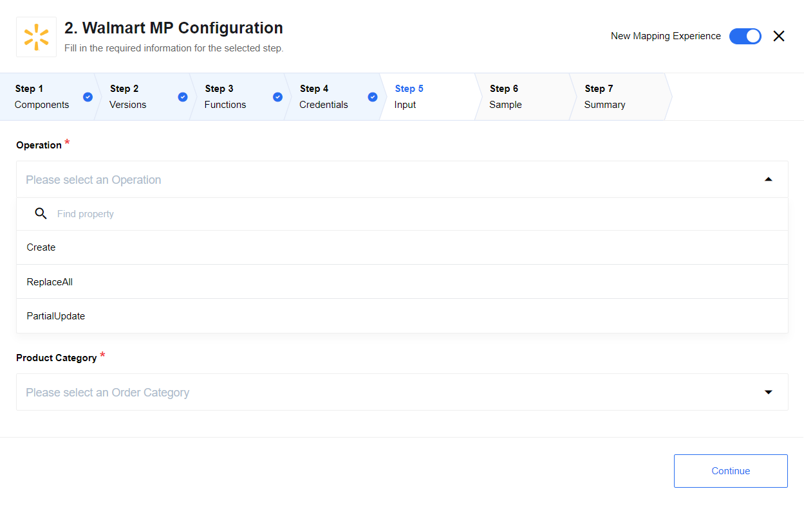
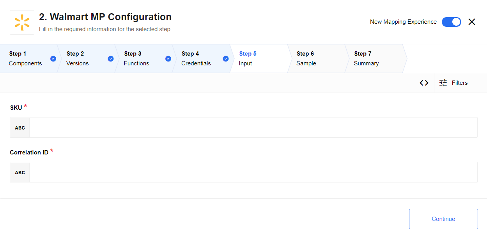
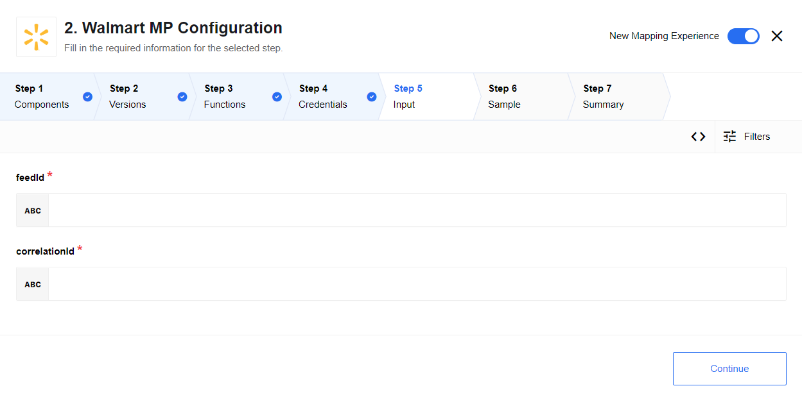

## Deprecated component

>**Plese note:** the Microsoft Dynamics CRM component has been **deprecated** and is no longer supported. 

## Description

The component implements following use cases:

#### Item Maintenance

* Create Item. Creates a new item
* Replace All. Replaces MPProduct and MPOffer information
* Partial Update. Merges the contents of item

#### Retrie Item

Completely deactivates and unpublishes an item from the site Feeds

* Get feed and item status - Returns the feed and item status for a specified Feed ID

For each request Correlation ID must be sent. It is a unique ID to correlate a vendor's calls with the Walmart system

## Credentials

For authentication user must provide the component with:

* Consumer ID
* Private Key
* Consumer Channel Type These API credentials can be generated from [Seller Center](https://sellerhelp.walmart.com/s/)

## Triggers

This component has no trigger functions. This means it will not be accessible to
select as a first component during the integration flow design.

## Actions

**1.** Submit Item

**2.** Submit Inventory

**3.** Retire Item

**4.** Update price

**5.** Get Feed and Item Status

## Walmart API references

Detailed information about Walmart API and actual XSD schemas can be referenced from here: [Marketplace API Guide](https://developer.walmart.com/#/apicenter/marketPlace/latest)
