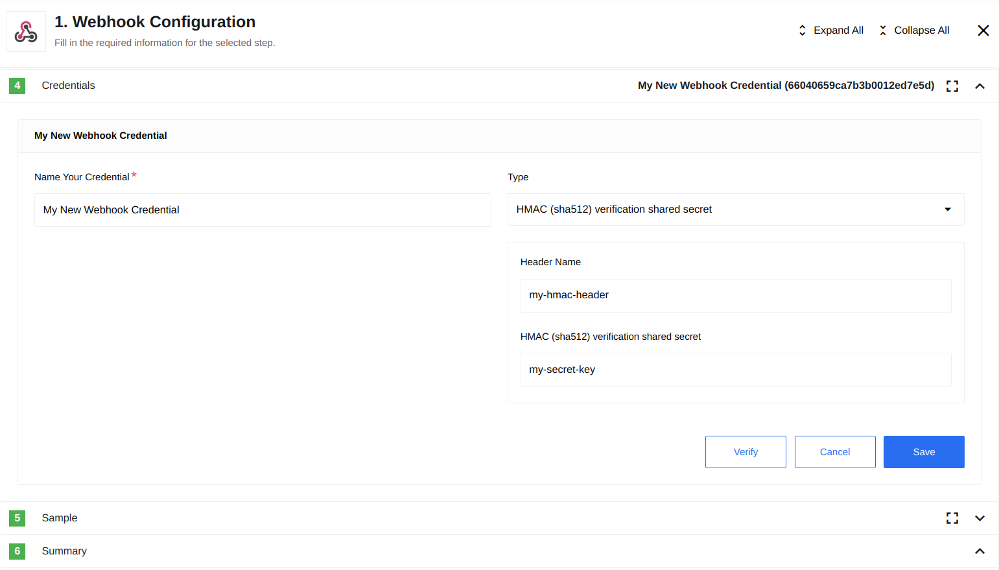

## Table of Contents

* [Description](#description)
* [Technical Notes](#technical-notes)
* [Credentials](#credentials)
* [Triggers](#triggers)
   * [Receive](#receive)
* [Supported Data Types](#supported-data-types)
* [Known Limitations](#known-limitations)

## Description

An open source component for sending and receiving [WebHooks](https://en.wikipedia.org/wiki/Webhook) on {{site.data.tenant.name}}.

## Technical Notes

The [technical notes](technical-notes) page gives some technical details about Webhook component like [changelog](/components/webhook/technical-notes#changelog).

## Credentials

The Webhook component supports the following authorisation types:


* **No Auth** - Use this method to interact with any open REST API.
* **Basic Auth** - Utilize this method to provide login credentials. This method includes the following fields:
  * **Username** - (string, required)
  * **Password** - (string, required)
* **API Key Auth** - Use this method to provide an API key as part of the headers to access the resource. This method includes the following fields:
  * **Header Name** - (string, required)
  * **Header Value** - (string, required)
* **HMAC (sha256/sha512) verification with shared secret** - Use this method to verify requests using a shared secret. This method includes the following fields:
  * **Header Name** - (string, optional, defaults to `x-eio-signature`)
  * **HMAC (sha256/sha512) verification shared secret** - (string, required)
  
  

## Triggers

### Receive

This is a simple webhook trigger that receives data as input and initiates the execution of the workflow.

#### Output Metadata
The message body emitted from the webhook will contain:
* A JSON object that was transferred using the `POST` method or query parameters in the case of a `GET` request.
* `_query` (object) - Contains the query parameters.
* `_headers` (object) - Contains the headers of the received request.
* `_method` (string, `POST` or `GET`) - Indicates the HTTP method of the received request.
* `_url` (string) - The full URL that was received.

Example:

```
  {
    "recievedBody": "recievedBody",
    "_query": {},
    "_headers": {
      "content-type": "application/json",
      "accept": "*/*",
      "accept-encoding": "gzip, deflate"
    },
    "_method": "POST",
    "_url": "/hook/5d691738cb5a286adc1e68e2"
  }
```

#### Webhook Response
By default, the webhook URL will respond with the following structure: 
```json
{
    "requestId": "86ad47dfbce4a8ae8a1eb505b85d8bd5",
    "message": "thank you"
}
```

However, you can specify the exact content of the reply using the [HTTP Reply](https://docs.elastic.io/components/request-reply/index.html) component. In this case, you will receive a reply only when the message reaches the step where the `HTTP Reply` is used, or if an error occurs in other steps between the `Webhook` step and the `HTTP Reply`.

## Supported Data Types

The Webhook component is capable of accepting various data types, with JSON being the most commonly used format due to its compatibility with the platform. However, the Webhook component can process different types of data, which will be explained in detail in this section.

<details close markdown="block"><summary><strong>Table Format</strong></summary>

Webhooks support the table format, specifically the x-www-form-urlencoded format. In this format, tabular data is converted into a JSON object with keys and values.

Postman Request Example:

{% include img.html max-width="100%" url="img/table-postman-request.png" title="Postman Request Example" %}

Received Webhook Payload Example:

{% include img.html max-width="50%" url="img/table-webhook-receive.png" title="Received Webhook Payload" %}

</details>

<details close markdown="block"><summary><strong>XML Format</strong></summary>

Webhooks also support the XML format. In this case, the result is a JSON object derived from an XML-structured document while preserving the nesting levels.

Postman Request Example:

{% include img.html max-width="100%" url="img/xml-postman-request.png" title="Postman Request" %}

Received Webhook Payload Example:

{% include img.html max-width="100%" url="img/xml-webhook-receive.png" title="Received Webhook Payload" %}

</details>

<details close markdown="block"><summary><strong>Binary File Format</strong></summary>

Additionally, webhooks support binary file formats for data reception. These files can include JSON, XML, CSV, as well as pictures in PNG and JPG formats, among others. It is crucial to ensure that the file extension matches the content format within the binary file. Otherwise, an error may occur during sending or the file content may not be properly detected if the extension is missing.

JSON Example:

{% include img.html max-width="50%" url="img/binary-json-example.png" title="JSON Example" %}

XML Example:

{% include img.html max-width="100%" url="img/binary-xml-example-1.png" title="XML Example" %}

{% include img.html max-width="50%" url="img/binary-xml-example-2.png" title="XML Example" %}

CSV Example:

{% include img.html max-width="100%" url="img/binary-csv-example-1.png" title="CSV Example" %}

{% include img.html max-width="100%" url="img/binary-csv-example-2.png" title="CSV Example" %}

Pictures Example:

Pictures are received as a sequence of bytes using the Buffer object.

{% include img.html max-width="100%" url="img/binary-pictures-example.png" title="Pictures Example" %}

By supporting these various data types, the Webhook component provides flexibility in processing data according to specific requirements and use cases.

</details>

## Known Limitations
* Currently, the component supports the following HTTP methods: `POST` and `GET`.
* When using a `POST` request, only `JSON` or `XML` data can be transferred to the workflow; other types, such as text or files, are not supported.
* `XML` data will be automatically converted to `JSON` format.
* The base path of the URL begins with the keyword `hook` followed by the flow ID, for example, `/hook/678119de28021e00129641fe`. You can append the desired path only after this base path, such as `/hook/678119de28021e00129641fe/sales/orders`.
