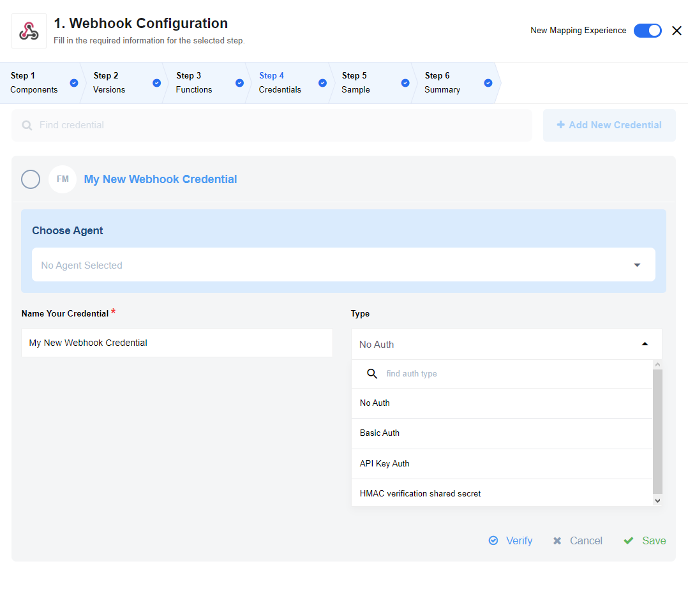
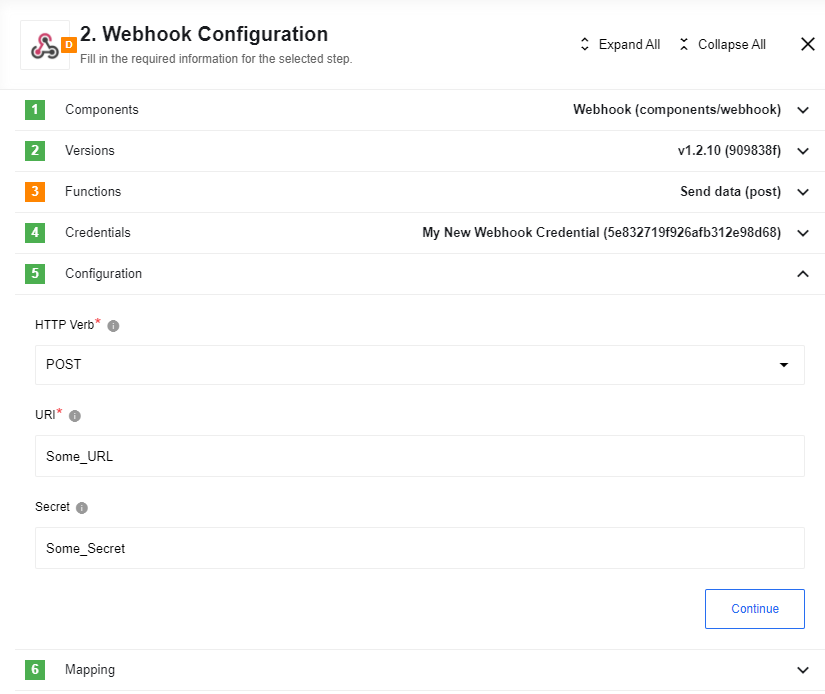

## Purpose

An open source component for sending and receiving [WebHooks](https://en.wikipedia.org/wiki/Webhook) on {{site.data.tenant.name}}.

## Credentials

Webhook component supports the following authorisation types:

* **No Auth** - use this method to work with any open REST API
* **Basic Auth** - use it to provide login credentials like username/password
* **API Key Auth** - use it to provide API Key to access the resource
* **HMAC verification shared secret** - use it to verify via a shared secret. Note: only SHA512 encryption algorithm is supported.



## Technical Notes

The [technical notes](technical-notes) page gives some technical details about Webhook component like [changelog](/components/webhook/technical-notes#changelog).

## Triggers

### Receive

Simple webhook trigger which receives data as an input and starts the flow execution after this.

Example:

```
  {
    "recievedBody": "recievedBody",
    "_query": {},
    "_headers": {
      "content-type": "application/json",
      "accept": "*/*",
      "accept-encoding": "gzip, deflate"
    },
    "_method": "POST",
    "_url": "/hook/5d691738cb5a286adc1e68e2"
  }
```

## Actions

### Send data (deprecated)

Simply sends data it receives as an input to a URL provided.

> Please note, that this action is deprecated which is marked in orange in the Funktions tab.

WebHook action can also be used to troubleshoot many processes to see the outcome.
For example one could create Invoices (in [Salesforce](https://www.salesforce.com/)) to Webhook flow and configure the Webhook with a url created in https://webhook.site or with any similar services.


### List of Expected Config fields


  * **[required]** **HTTP Verb**
    *   **POST**. The WebHook component can POST information to preconfigured WebHook address. This action could be used for different purposes. For example WebHook can be used to inform your custom connector about an event which it waits to work.
    *   **PUT**. The WebHook component can also PUT a specific preconfigured JSON into specific address where the process will not be handled by the server. For this reason the "Output JSON Sample" field can be used.

  * **[required]** **URI**. This is the address to send WebHook.
  * **[not required]** **Secret**. This is an optional field to authenticate WebHook POST. There maybe cases when a special password or a secret might be required. For example the WebHook address was generated explicitly with a password so that to prevent any third parties to use it. This could be your specific WebHook address that you use to send your Wordpress posts into your server.



Example:

```
    {
        "recievedBody": "recievedBody",
        "_query": {},
        "_headers": {
          "content-type": "application/json",
          "accept": "*/*",
          "accept-encoding": "gzip, deflate"
        },
        "_method": "POST",
        "_url": "/hook/5d691738cb5a286adc1e68e2"
      }
```

## Known limitations

1. Maximal possible size for an attachment is 10 MB.

2. Attachments mechanism does not work with the Local Agents.
