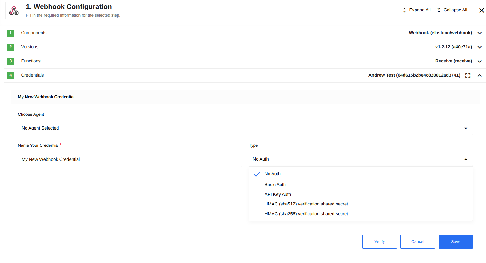

## Purpose

An open source component for sending and receiving [WebHooks](https://en.wikipedia.org/wiki/Webhook) on {{site.data.tenant.name}}.

## Credentials

Webhook component supports the following authorisation types:



* **No Auth** - use this method to work with any open REST API.
* **Basic Auth** - use it to provide login credentials like username/password.
* **API Key Auth** - use it to provide API Key to access the resource.
* **HMAC verification shared secret** - use it to verify via a shared secret.

  Component supporting 2 types of HMAC verification shared secrets:
    - **SHA512**
    - **SHA256**
    
  For both cases of HMAC authentication it is possible to specify the fields:
  1. **Header Name** - responsible for the Header title passing the request signature.
  2. **HMAC verification shared secret** - responsible for the encryption secret key.
  
  


## Technical Notes

The [technical notes](technical-notes) page gives some technical details about Webhook component like [changelog](/components/webhook/technical-notes#changelog).

## Triggers

### Receive

Simple webhook trigger which receives data as an input and starts the flow execution after this.

Example:

```
  {
    "recievedBody": "recievedBody",
    "_query": {},
    "_headers": {
      "content-type": "application/json",
      "accept": "*/*",
      "accept-encoding": "gzip, deflate"
    },
    "_method": "POST",
    "_url": "/hook/5d691738cb5a286adc1e68e2"
  }
```

## Supported Data Types

The Webhook component is capable of accepting various data types, with JSON being the most commonly used format due to its compatibility with the platform. However, the Webhook component can process different types of data, which will be explained in detail in this section.

<details close markdown="block"><summary><strong>Table Format</strong></summary>

Webhooks support the table format, specifically the x-www-form-urlencoded format. In this format, tabular data is converted into a JSON object with keys and values.

Postman Request Example:

{% include img.html max-width="100%" url="img/table-postman-request.png" title="Postman Request Example" %}

Received Webhook Payload Example:

{% include img.html max-width="50%" url="img/table-webhook-receive.png" title="Received Webhook Payload" %}

</details>

<details close markdown="block"><summary><strong>XML Format</strong></summary>

Webhooks also support the XML format. In this case, the result is a JSON object derived from an XML-structured document while preserving the nesting levels.

Postman Request Example:

{% include img.html max-width="100%" url="img/xml-postman-request.png" title="Postman Request" %}

Received Webhook Payload Example:

{% include img.html max-width="100%" url="img/xml-webhook-receive.png" title="Received Webhook Payload" %}

</details>

<details close markdown="block"><summary><strong>Binary File Format</strong></summary>

Additionally, webhooks support binary file formats for data reception. These files can include JSON, XML, CSV, as well as pictures in PNG and JPG formats, among others. It is crucial to ensure that the file extension matches the content format within the binary file. Otherwise, an error may occur during sending or the file content may not be properly detected if the extension is missing.

JSON Example:

{% include img.html max-width="50%" url="img/binary-json-example.png" title="JSON Example" %}

XML Example:

{% include img.html max-width="100%" url="img/binary-xml-example-1.png" title="XML Example" %}

{% include img.html max-width="50%" url="img/binary-xml-example-2.png" title="XML Example" %}

CSV Example:

{% include img.html max-width="100%" url="img/binary-csv-example-1.png" title="CSV Example" %}

{% include img.html max-width="100%" url="img/binary-csv-example-2.png" title="CSV Example" %}

Pictures Example:

Pictures are received as a sequence of bytes using the Buffer object.

{% include img.html max-width="100%" url="img/binary-pictures-example.png" title="Pictures Example" %}

By supporting these various data types, the Webhook component provides flexibility in processing data according to specific requirements and use cases.

</details>

## Known limitations

1. Maximal possible size for an attachment is 10 MB.

2. Attachments mechanism does not work with the Local Agents.
