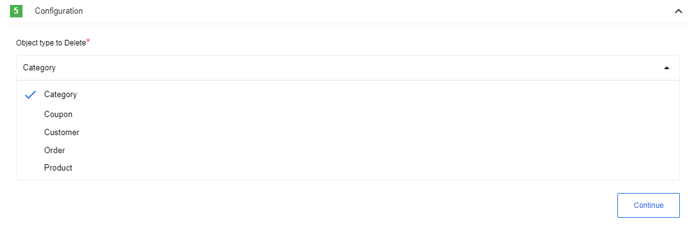

## Credentials

You need the following to use the WooCommerce connector:

 * **Store URL** (string, required) - Specify URL of your store REST API endpoint.
 * **Consumer Key** (string, required) - Private key generated by WooCommerce admin panel
 * **Consumer Secret** (string, required) - Private secret generated by WooCommerce admin panel

The following steps outline how to generate store API Credentials.

1. Navigate to **WooCommerce > Settings > Advanced > REST API **
1. Push Add key button and generate new key for the user.

## Triggers

### Webhook

Receive data from WooCommerce based on configured [webhooks](https://woocommerce.com/document/webhooks/):

### Config Fields

 * **Secret** - You need provide Secret Key from WooCommerce application here

 >**Please Note:** You will get error during webhook requests if this field will be incorrect

#### Output Metadata

Triggered object from WooCommerce

## Actions

### Raw Request

Action to call any WooCommerce API endpoint

#### Config Fields

* **Throw Error on 404 Response** - (optional) Treat 404 HTTP responses as errors, defaults to `false`.

#### Input Metadata

* **Url** (string, required) - Path of the resource relative to the URL base in credentials - `Store URL`
* **Method** (enum, required) - Allowed values `GET`, `POST`, `PUT`, `PATCH`, `DELETE`. HTTP verb to use in the request
* **Request Body** (json/string, optional) - Body of the request to send

### Upsert Object

An action creates or update a single object.

#### Config Fields

* **Object type** (dropdown, required) - Object type for upsert

#### Input Metadata

Dynamically generated for selected Object type. If you fill up 'id' field, component will update record, otherwise create.
To erase field value during update, you need to provide it with empty value (in UI you can use Developer mode)

#### Output Metadata

Dynamically generated for selected Object type

### Delete Object

An action delete a single object.

#### Config Fields

* **Object type** (dropdown, required) - Object type for deletion

#### Input Metadata

* **id** (string, required) - unique identifier for selected object
* **force** (boolean, optional) - needs to be `true` if resource does not support trashing.
* **reassign** (number, optional) - User ID to reassign posts to, available only for customers

#### Output Metadata

Dynamically generated for selected Object type

#### Limitations

Delete `category` action should be used with `force` property set to `true` due to the limitations of the current WooCommerce REST API implementation

### Lookup Object (at most 1)

An action return a single object specified by ID

#### Config Fields

* **Object type** (dropdown, required) - Object type for lookup

#### Input Metadata

* **id** (string, required) - unique identifier for selected object
* **context** (enum, optional) - Scope under which the request is made; determines fields present in response. Options: `view` and `edit`. Default is `view`.

#### Output Metadata

Dynamically generated for selected Object type

### Lookup Objects

Lookup Objects by criteria

#### Config Fields

* **Object type** (dropdown, required) - Indicates Object Type to find
* **Emit behavior** (dropdown, required) - options: `Fetch all`, `Fetch page`, `Emit individually`, required

#### Input Metadata

* **Fields:**

  

<strong>Products</strong>

  |Parameter|Type|Description|
  |----|-----------|-----------|
  |context|string|Scope under which the request is made; determines fields present in response. Options: `view` and `edit`. Default is `view`.|
  |page|integer|Current page of the collection. Default is `1`.|
  |per_page|integer|Maximum number of items to be returned in result set. Default is `10`.|
  |search|string|Limit results to those matching a string.|
  |after|string|Limit response to resources published after a given ISO8601 compliant date.|
  |before|string|Limit response to resources published before a given ISO8601 compliant date.|
  |exclude|array|Ensure result set excludes specific IDs.|
  |include|array|Limit result set to specific ids.|
  |offset|integer|Offset the result set by a specific number of items.|
  |order|string|Order sort attribute ascending or descending. Options: `asc` and `desc`. Default is `desc`.|
  |orderby|string|Sort collection by object attribute. Options: `date`, `id`, `include`, `title`, `slug`, `price`, `popularity` and `rating`. Default is `date`.|
  |parent|array|Limit result set to those of particular parent IDs.|
  |parent_exclude|array|Limit result set to all items except those of a particular parent ID.|
  |slug|string|Limit result set to products with a specific slug.|
  |status|string|Limit result set to products assigned a specific status. Options: `any`, `draft`, `pending`, `private` and `publish`. Default is `any`.|
  |type|string|Limit result set to products assigned a specific type. Options: `simple`, `grouped`, `external` and `variable`.|
  |sku|string|Limit result set to products with a specific SKU.|
  |featured|boolean|Limit result set to featured products.|
  |category|string|Limit result set to products assigned a specific category ID.|
  |tag|string|Limit result set to products assigned a specific tag ID.|
  |shipping_class|string|Limit result set to products assigned a specific shipping class ID.|
  |attribute|string|Limit result set to products with a specific attribute.|
  |attribute_term|string|Limit result set to products with a specific attribute term ID (required an assigned attribute).|
  |tax_class|string|Limit result set to products with a specific tax class. Default options: `standard`, `reduced-rate` and `zero-rate`.|
  |on_sale|boolean|Limit result set to products on sale.|
  |min_price|string|Limit result set to products based on a minimum price.|
  |max_price|string|Limit result set to products based on a maximum price.|
  |stock_status|string|Limit result set to products with specified stock status. Options: `instock`, `outofstock` and `onbackorder`.|

  

  

<strong>Categories</strong>

  |Parameter|Type|Description|
  |----|-----------|-----------|
  |context|string|Scope under which the request is made; determines fields present in response. Options: `view` and `edit`. Default is `view`.|
  |page|integer|Current page of the collection. Default is `1`.|
  |per_page|integer|Maximum number of items to be returned in result set. Default is `10`.|
  |search|string|Limit results to those matching a string.|
  |exclude|array|Ensure result set excludes specific ids.|
  |include|array|Limit result set to specific ids.|
  |order|string|Order sort attribute ascending or descending. Options: `asc` and `desc`. Default is `asc`.|
  |orderby|string|Sort collection by resource attribute. Options: `id`, `include`, `name`, `slug`, `term_group`, description and count. Default is `name`.|
  |hide_empty|boolean|Whether to hide resources not assigned to any products. Default is `false`.|
  |parent|integer|Limit result set to resources assigned to a specific parent.|
  |product|integer|Limit result set to resources assigned to a specific product.|
  |slug|string|Limit result set to resources with a specific slug.|

  

  

<strong>Coupons</strong>

  |Parameter|Type|Description|
  |----|-----------|-----------|
  |context|string|Scope under which the request is made; determines fields present in response. Options: `view` and `edit`.   Default is `view`.|
  |page|integer|Current page of the collection. Default is `1`.|
  |per_page|integer|Maximum number of items to be returned in result set. Default is `10`.|
  |search|string|Limit results to those matching a string.|
  |after|string|Limit response to resources published after a given ISO8601 compliant date.|
  |before|string|Limit response to resources published before a given ISO8601 compliant date.|
  |exclude|array|Ensure result set excludes specific IDs.|
  |include|array|Limit result set to specific ids.|
  |offset|integer|Offset the result set by a specific number of items.|
  |order|string|Order sort attribute ascending or descending. Options: `asc` and `desc`. Default is `desc`.|
  |orderby|string|Sort collection by object attribute. Options: `date`, `id`, `include`, `title` and `slug`. Default is `date`.|
  |code|string|Limit result set to resources with a specific code.|

  

  

<strong>Customers</strong>

  |Parameter|Type|Description|
  |----|-----------|-----------|
  |context|string|Scope under which the request is made; determines fields present in response. Options: `view` and `edit`. Default is `view`.|
  |page|integer|Current page of the collection. Default is `1`.|
  |per_page|integer|Maximum number of items to be returned in result set. Default is `10`.|
  |search|string|Limit results to those matching a string.|
  |exclude|array|Ensure result set excludes specific IDs.|
  |include|array|Limit result set to specific IDs.|
  |offset|integer|Offset the result set by a specific number of items.|
  |order|string|Order sort attribute ascending or descending. Options: `asc` and `desc`. Default is `asc`.|
  |orderby|string|Sort collection by object attribute. Options: `id`, `include`, `name` and `registered_date`. Default is `name`.|
  |email|string|Limit result set to resources with a specific email.|
  |role|string|Limit result set to resources with a specific role. Options: `all`, `administrator`, `editor`, `author`, `contributor`, `subscriber`, `customer` and `shop_manager`. Default is `customer`.|

  

  

<strong>Orders</strong>

  |Parameter|Type|Description|
  |----|-----------|-----------|
  |context|string|Scope under which the request is made;   determines fields present in response. Options: `view` and `edit`.   Default is `view`.|
  |page|integer|Current page of the collection. Default is `1`.|
  |per_page|integer|Maximum number of items to be returned in result set. Default is `10`.|
  |search|string|Limit results to those matching a string.|
  |after|string|Limit response to resources published after a given ISO8601 compliant date.|
  |before|string|Limit response to resources published before a given ISO8601 compliant date.|
  |exclude|array|Ensure result set excludes specific IDs.|
  |include|array|Limit result set to specific ids.|
  |offset|integer|Offset the result set by a specific number of items.|
  |order|string|Order sort attribute ascending or descending. Options: `asc` and `desc`. Default is `desc`.|
  |orderby|string|Sort collection by object attribute. Options: `date`, `id`, `include`, `title` and `slug`. Default is `date`.|
  |parent|array|Limit result set to those of particular parent IDs.|
  |parent_exclude|array|Limit result set to all items except those of a particular parent ID.|
  |status|array|Limit result set to orders assigned a specific   status. Options: `any`, `pending`, `processing`, `on-hold`, `completed`, `cancelled`, `refunded`, `failed` and `trash`. Default is `any`.|
  |customer|integer|Limit result set to orders assigned a specific customer.|
  |product|integer|Limit result set to orders assigned a specific product.|
  |dp|integer|Number of decimal points to use in each resource. Default is `2`.|
  

#### Output Metadata

- For `Fetch page` and `Fetch All`: An object with key ***results*** that has an array as its value
- For `Emit Individually`:  Each object fill the entire message

#### Limitations

* If **Emit behavior** set to `Fetch page` or field `page` filled up inside input metadata, component will process only **one** page, otherwise it collect all objects in WooCommerce

* Input Metadata fields description actual to `v3` api version
