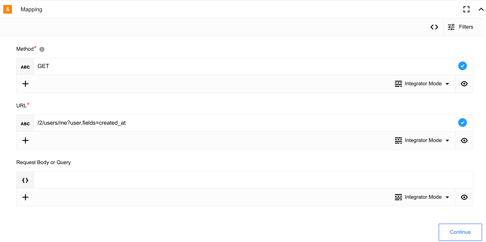
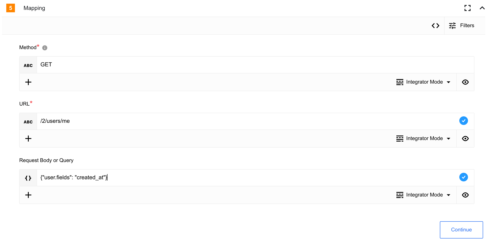

### Credentials

To authenticate the component you will need to create an App in [developer portal’s App page](https://developer.twitter.com/en/portal/projects-and-apps), the component uses OAuth 1.0a. [more info](https://developer.twitter.com/en/docs/apps/overview).

Component credentials configuration fields:
- **Consumer key** (string, required) - Consumer API key
- **Consumer secret** (string, required) - Consumer API secret
- **Access token key** (string, required) - Authentication access token
- **Access token secret** (string, required) - Authentication access secret


## Triggers
This component has no trigger functions. This means it will not be accessible to
select as a first component during the integration flow design.


## Actions

### Post tweet

Post new tweet.

#### Configuration Fields

Has no any configuration fields.

#### Input Metadata

* **Text** - (string, required): Text of your tweet.

#### Output Metadata

- **id** - (string, required): Unique identifier of your tweet

- **text** - (string, required): Text of your tweet

- **edit_history_tweet_ids** - (array, required): list of tweet ids edit history

### Make Raw Request

Executes custom request.

#### Configuration Fields

Has no any configuration fields.

#### Input Metadata

- **Url** - (string, required): Path of the resource. e.g.: `/2/users/me`

- **Method** - (string, required): HTTP verb to use in the request, one of `GET`, `POST`, `PUT`, `PATCH`, `DELETE`.

- **Request Body or Query** - (object, optional): Body of the request to send for `POST`, `PUT`, and `PATCH` or query for `GET` and `DELETE` methods

#### Output Metadata

- **headers** - (object, required): HTTP headers of the response.
- **responseBody** - (object, optional): HTTP response body.

#### Usage example:
**Get logged user information with creation date using Url**



```json
{
  "method": "GET",
  "url": "/2/users/me?user.fields=created_at"
}
```

**Get logged user information with creation date using Request Body or Query field**


```json
{
"method": "GET",
"url": "/2/users/me",
"data": {
  "user.fields": "created_at"
  }
}
```

## Known limitations

Please visite [Twitter API v2 API limits](https://developer.twitter.com/en/docs/twitter-api/rate-limits)
