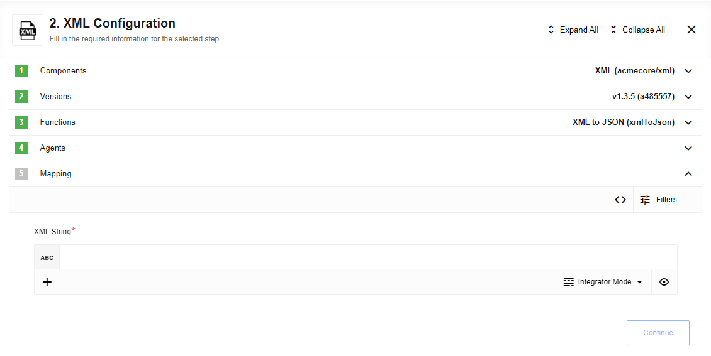

## Table of Contents

* [Description](#description)
  * [Purpose](#purpose)
  * [Requirements and Conversion Behavior](#requirements-and-conversion-behavior)
  * [Environment variables](#environment-variables)
* [Actions](#actions)
  * [XML to JSON](#xml-to-json)
  * [XML Attachment to JSON](#xml-attachment-to-json)
  * [JSON to XML](#json-to-xml)
* [Usage Example](#usage-example)
* [Known limitations](#known-limitations)

## Description

{{page.description}}

### Purpose
This component converts XML attachments or strings to and from JSON. It exposes three actions that accept either well‑formed XML/JSON strings or XML attachments and returns the converted payload as a string or attachment. The result can be consumed by downstream components.

### Requirements and Conversion Behavior

Provided XML document (for XML to JSON) should be [well-formed](https://en.wikipedia.org/wiki/Well-formed_document) in order to be parsed correctly. You will get an error otherwise.

JSON inputs must be objects with exactly one field as XML documents must be contained in a single 'root' tag.
[JSON inputs can not have any field names which are not valid as XML tag names:](https://www.w3schools.com/xml/xml_elements.asp)

* They must start with a letter or underscore
* They cannot start with the letters xml (or XML, or Xml, etc)
* They must only contain letters, digits, hyphens, underscores, and periods

XML attributes on a tag can be read and set by setting an `_attr` sub-object in the JSON.  
The inner-text of an XML element can also be controlled with `#` sub-object.

<details close markdown="block"><summary><strong>Click to expand for more details</strong></summary>

For example:

```json
{
  "someTag": {
    "_attr": {
      "id": "my id"
    },
    "_": "my inner text"
  }
}
```

is equivalent to

```xml
<someTag id="my id">my inner text</someTag>
```

</details>

### Environment variables

* `MAX_FILE_SIZE`: *optional* - Controls the maximum size of an attachment to be read or written in MB.
  Defaults to 10 MB where 1 MB = 1024 * 1024 bytes.

* `EIO_REQUIRED_RAM_MB`: *optional* - You can increase memory usage limit for component if you going to work with big files
  Defaults to 256 MB where 1 MB = 1024 * 1024 bytes.

## Trigger

This component has no trigger functions. This means you can not select it as a first
component during the integration flow design.

## Actions

It allows users to convert XML attachments and strings to and from JSON. This component has 3 actions allowing users to pass in either generic but well-formatted XML/JSON strings or XML attachments and produces a generic string or attachment of the other file type. The output then can be mapped and used in other components.

### XML to JSON

Takes XML string and converts it to a generic JSON object.



### Limitation

Value inside xml tags will be converting into string only. It means that first, you need to convert string numbers - to numbers.

* `$number("5")` => `5`
* `["1", "2", "3", "4", "5"].$number()` => `[1, 2, 3, 4, 5]`

<details close markdown="block"><summary><strong>Click to expand for more details</strong></summary>

given xml

```xml
<note>
  <date>2015-09-01</date>
  <hour>08:30</hour>
  <to>Tove</to>
  <from>Jani</from>
  <body>Don't forget me this weekend!</body>
</note>
```

{% include img.html max-width="100%" url="img/xml-to-json-1.png" title="XML string" %}

will be converted into:

```json
{
  "note": {
    "id": "322",
    "to": "Tove",
    "from": "Jani",
    "heading": "Reminder",
    "body": "Don't forget me this weekend!"
  }
}
```

{% include img.html max-width="100%" url="img/xml-to-json-2.png" title="Convert into JSON" %}

</details>

### XML Attachment to JSON

Looks at the JSON array of attachments passed in to component and converts all
XML that it finds to generic JSON objects and produces one outbound message per
matching attachment. As input, the user can enter a patter pattern for filtering
files by name or leave this field empty for processing all incoming `*.xml` files.

{% include img.html max-width="100%" url="img/xml-attachment.png" title="XML Attachment" %}

#### Configuration Fields

* **Pattern** - (string, optional): RegEx for filtering files by name provided via old attachment mechanism (outside message body)
* **Upload single file** - (checkbox, optional): Use this option if you want to upload a single file

#### Input Metadata

If `Upload single file` is checked, there will be 2 fields:
* **URL** - (string, required): link to file on the Internet or platform

If `Upload single file` is unchecked:
* **Attachments** - (array, required): Collection of files to upload, each record contains object with two keys:
  * **URL** - (string, required): link to file on the Internet or platform

If you going to use this option with static data, you need to switch to Developer mode

<details close markdown="block"><summary><strong>Sample</strong></summary>

```json
  {
    "attachments": [
      {
        "url": "https://example.com/files/file1.xml"
      },
      {
        "url": "https://example.com/files/file2.xml"
      }
    ]
  }
  ```

</details>

#### Output Metadata

Resulting JSON object

### JSON to XML

Provides an input where a user provides a JSONata expression that should evaluate to an object to convert to JSON.
See [Requirements & Conversion Behavior](#requirements-and-conversion-behavior) for details on conversion logic.

{% include img.html max-width="100%" url="img/json-to-xml.png" title="XML Attachment to JSON" %}

When creating XML files with invalid XML tags, the name of the potentially invalid tag will not be reported. XML tags are case-sensitive. The tag `<Text>` is different from the tag `<text>`.

Opening and closing tags must be written with the same case:

`<message>Hello, World!</message>`

The following options are supported:

<details close markdown="block"><summary><strong>Click to expand for more details</strong></summary>

* **Upload XML as file to attachments**: When checked, the resulting XML will be placed directly into an attachment.
The attachment information will be provided in both the message's attachments section as well as `attachmentUrl` and `attachmentSize`
will be populated. The attachment size will be described in bytes.  
When this box is not checked, the resulting XML will be provided in the `xmlString` field.

* **Exclude XML Header/Description**: When checked, no XML header of the form `<?xml version="1.0" encoding="UTF-8" standalone="no"?>` will be prepended to the XML output.

* **Is the XML file standalone**: When checked, the xml header/description will have a value of `yes` for standalone. Otherwise, the value will be `no`. Has no effect when XML header/description is excluded.

The incoming message should have a single field `input`. When using integrator mode, this appears as the input **JSON to convert** When building mappings in developper mode, one must set the `input` property. E.g.:

```
{
  "input": {
             "someTag": {
               "_attr": {
                 "id": "my id"
               },
               "_": "my inner text"
             }
           }
}
```

{% include img.html max-width="100%" url="img/json-to-xml-2.png" title="JSON to XML" %}

</details>

## Usage Example

We have created a special [document](use-case) that contains an example to better understand how the XML component works.

## Known limitations

 *   The maximum size of incoming file for processing is 5 MB. If the size of incoming file will be more than 5 MB, action will throw an error:

```sh
Attachment *.xml is to large to be processed my XML component.
File limit is: 5242880 byte, file given was: * byte
```

- All actions involving attachments are not supported on local agents due to current platform limitations.
- When creating XML files with invalid XML tags, the name of the potentially invalid tag will not be reported.
- When you try to retrieve a sample in `XML Attachment to JSON` action and it's size is more than 500Kb, there will be generated new smaller sample with the same structure as original
