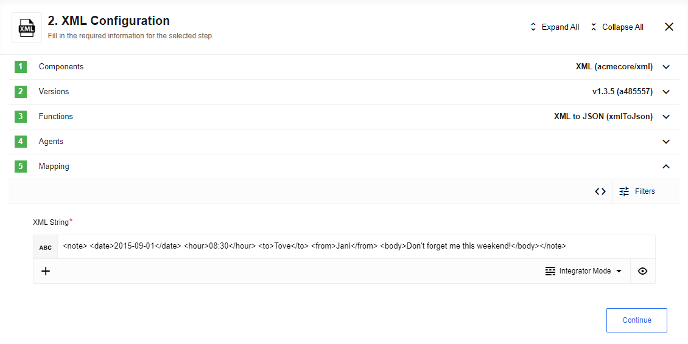
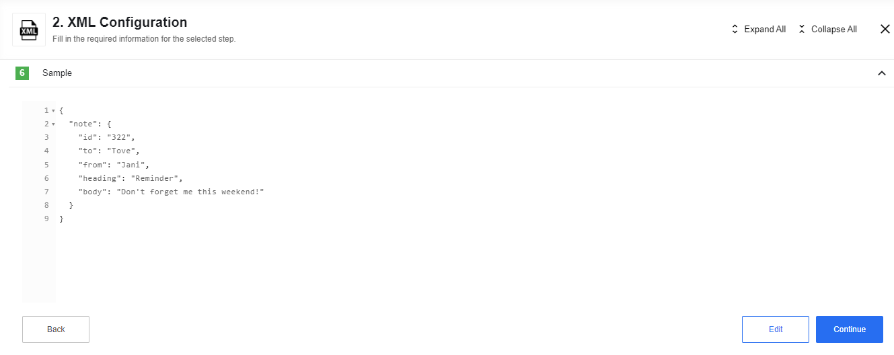
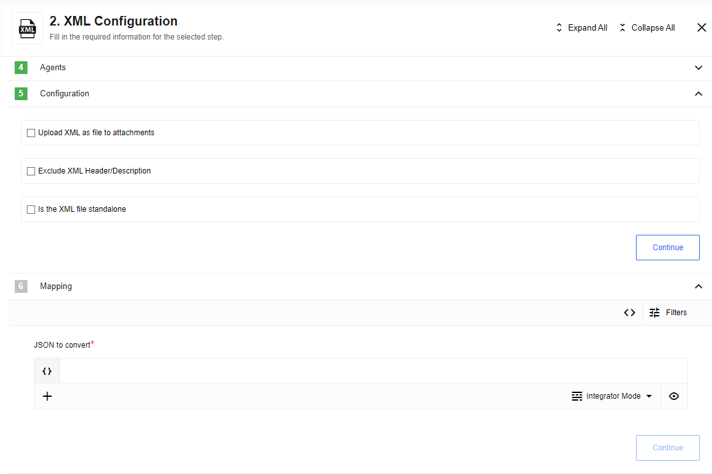

## Description

iPaaS component to convert between XML and JSON data.

### Purpose

Allows users to convert XML attachments and strings to and from JSON.
This component has 3 actions allowing users to pass in either generic but well formatted XML/JSON strings or XML attachments
and produces a generic string or attachment of the other file type. The output then can be mapped and used in other components.

### Requirements and Conversion Behavior

Provided XML document (for XML to JSON) should be [well-formed](https://en.wikipedia.org/wiki/Well-formed_document) in order to be parsed correctly. You will get an error otherwise.

JSON inputs must be objects with exactly one field as XML documents must be contained in a single 'root' tag.
[JSON inputs can not have any field names which are not valid as XML tag names:](https://www.w3schools.com/xml/xml_elements.asp)

* They must start with a letter or underscore
* They cannot start with the letters xml (or XML, or Xml, etc)
* They must only contain letters, digits, hyphens, underscores, and periods

XML attributes on a tag can be read and set by setting an `_attr` sub-object in the JSON.  
The inner-text of an XML element can also be controlled with `#` sub-object.

For example:

```json
{
  "someTag": {
    "_attr": {
      "id": "my id"
    },
    "_": "my inner text"
  }
}
```

is equivalent to

```xml
<someTag id="my id">my inner text</someTag>
```

### Environment variables

* `MAX_FILE_SIZE`: *optional* - Controls the maximum size of an attachment to be written in MB.
Defaults to 10 MB where 1 MB = 1024 * 1024 bytes.

## Trigger

This component has no trigger functions. This means you can not select it as a first
component during the integration flow design.

## Actions

### XML to JSON

Takes XML string and converts it to generic JSON object.

### Limitation

Value inside xml tags will be converting into string only, e.g.:   

given xml

```xml
<note>
  <date>2015-09-01</date>
  <hour>08:30</hour>
  <to>Tove</to>
  <from>Jani</from>
  <body>Don't forget me this weekend!</body>
</note>
```



will be converted into:

```json
{
  "note": {
    "id": "322",
    "to": "Tove",
    "from": "Jani",
    "heading": "Reminder",
    "body": "Don't forget me this weekend!"
  }
}
```



### XML Attachment to JSON

Looks at the JSON array of attachments passed in to component and converts all
XML that it finds to generic JSON objects and produces one outbound message per
matching attachment. As input, the user can enter a patter pattern for filtering
files by name or leave this field empty for processing all incoming `*.xml` files.


### JSON to XML

Provides an input where a user provides a JSONata expression that should evaluate to an object to convert to JSON.
See [Requirements & Conversion Behavior](#requirements-and-conversion-behavior) for details on conversion logic.
The following options are supported:

* **Upload XML as file to attachments**: When checked, the resulting XML will be placed directly into an attachment.
The attachment information will be provided in both the message's attachments section as well as `attachmentUrl` and `attachmentSize`
will be populated. The attachment size will be described in bytes.  
When this box is not checked, the resulting XML will be provided in the `xmlString` field.

* **Exclude XML Header/Description**: When checked, no XML header of the form `<?xml version="1.0" encoding="UTF-8" standalone="no"?>` will be prepended to the XML output.

* **Is the XML file standalone**: When checked, the xml header/description will have a value of `yes` for standalone. Otherwise, the value will be `no`. Has no effect when XML header/description is excluded.

The incoming message should have a single field `input`. When using integrator mode, this appears as the input **JSON to convert** When building mappings in developper mode, one must set the `input` property. E.g.:

```
{
  "input": {
             "someTag": {
               "_attr": {
                 "id": "my id"
               },
               "_": "my inner text"
             }
           }
}
```



## Known limitations

 *   The maximum size of incoming file for processing is 5 MB. If the size of incoming file will be more than 5 MB, action will throw an error:

```sh
Attachment *.xml is to large to be processed my XML component.
File limit is: 5242880 byte, file given was: * byte
```

- All actions involving attachments are not supported on local agents due to current platform limitations.
- When creating XML files with invalid XML tags, the name of the potentially invalid tag will not be reported.


## Additional Info

Icon made by Freepik from [www.flaticon.com](https://www.flaticon.com)
