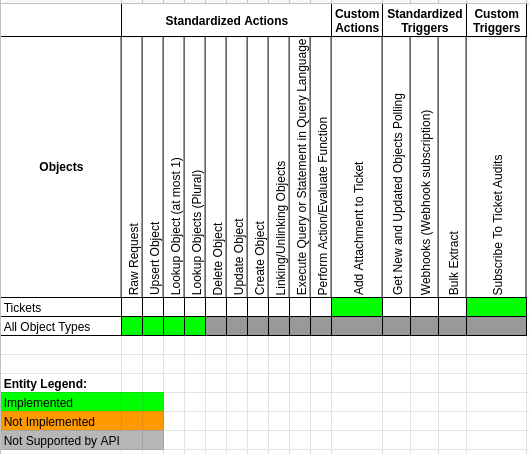

## Changelog

### 1.0.2 (September 09, 2022)

* Update Sailor version to 2.6.29
* Get rid of vulnerabilities in dependencies
* Update component-commons-library version to 3.0.2

### 1.0.1 (April 14, 2022)

* Update Sailor version to 2.6.27
* Get rid of vulnerabilities in dependencies
* Add component pusher job to Circle.ci config
* Update component-commons-library version to 2.0.2
* Fix attachments processing

### 1.0.0 (June 6, 2021)

* Initial release

* Add new actions:

- `Lookup Object By Id`
- `Lookup Objects`
- `Make Raw Request`
- `Upsert Object By Id`
- `Add Attachment to Ticket`

* Add new trigger:

- `Subscribe To Ticket Audits`

## Completeness Matrix

Here is the Completeness Matrix for the Zendesk component:

