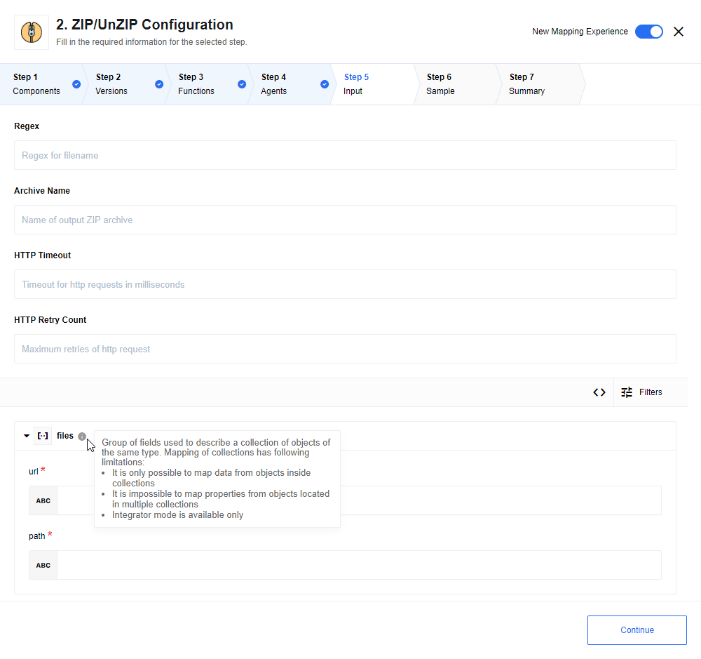
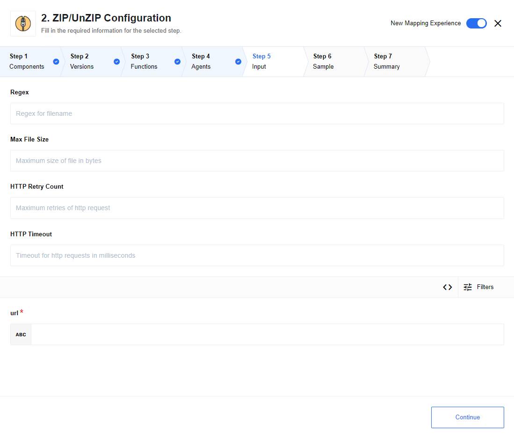

## Environment variables

This component has non-mandatory environment variable:

* `ZIP_TTL` - it defaults to 60000 milliseconds(60sec), if other value is not defined.
Number of millisecond of time to live for zip files, unZip action downloads zip files into filesystem.ZIP action launch scheduler that will deleted files older than allowed ttl(time to live).

* `REQUEST_MAX_CONTENT_LENGTH` - default 1GB. Number of bytes, max content length for uploading attachments.

## Triggers

This component has no trigger functions. This means it will not be accessible to
select as a first component during the integration flow design.

## Actions

### ZIP action

ZIP provided files. Iterate over body `files`, for each member if `path` match
configured `regex` download file from provided `url`, and append them to zip using
provided `path` as location and name of the file. Output contains attachment with
url to archive:

### Configuration fields description

* `regex` - default match all `'[^]*'`. Regex for filename with extension, only files that matches regex will be add to ZIP.

* `httpTimeout` - default 60000 milliseconds(60 sec), number of milliseconds for http request timeouts

* `httpRetry` - default 3, number of retry for http request

* `zipName` - by default generate uuid name with `.zip` extension. Output zip filename with extension.

### Input and output schema description

Input schema

Contains array of items with properties:

* `url` - url to file, from where file can be downloaded

* `path` - path under which file will be stored inside zip, regex perform validation only over filename with extension part of path

Output schema:

Contains property size in body, and url to created archive in attachments.

### UnZIP action

Unzip provided zip file. Only files that match `regex` and with uncompressed size less than  `maxFileSize` will be unzipped:

### Configuration fields description

* `regex` - default match all `'[^]*'`. Regex for filename with extension, only files that matches regex will be unzipped.

* `maxFileSize` - default 104857600 bytes(100mb), number of bytes. Maximum file size, files with uncompressed size bigger than provided value will not be unzipped

* `httpTimeout` - default 60000 milliseconds(60 sec), number of milliseconds for http request timeouts

* `httpRetry` - default 3, number of retry for http request

### Input and output schema description

Input schema:

Contains property `url` that provided url to zip, that will be downloaded and unzipped.

Output schema

Contains array of items with properties:

* `filename`- name of file with extension
* `size` - uncompressed file size

## Limitations

1. Attachments mechanism does not work with the Local Agent Installation
