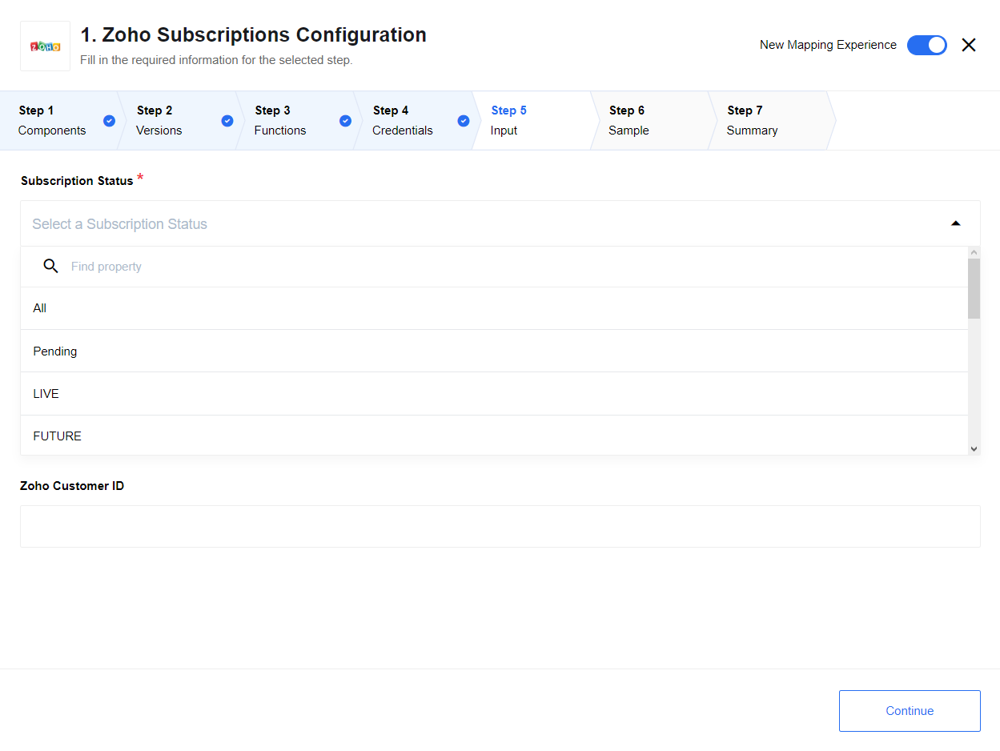
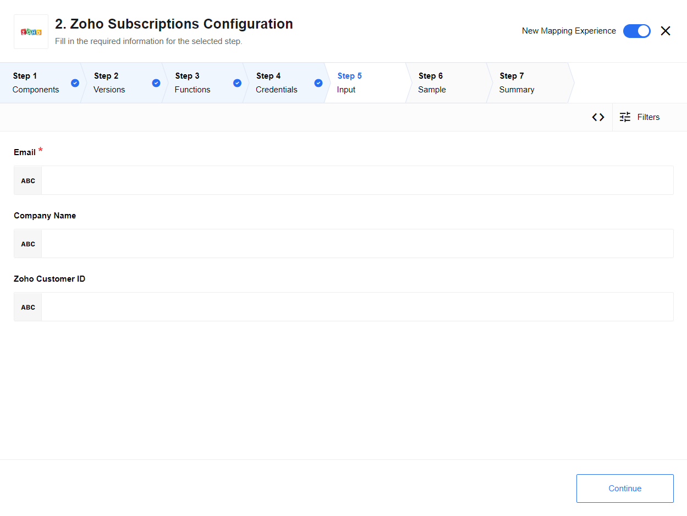
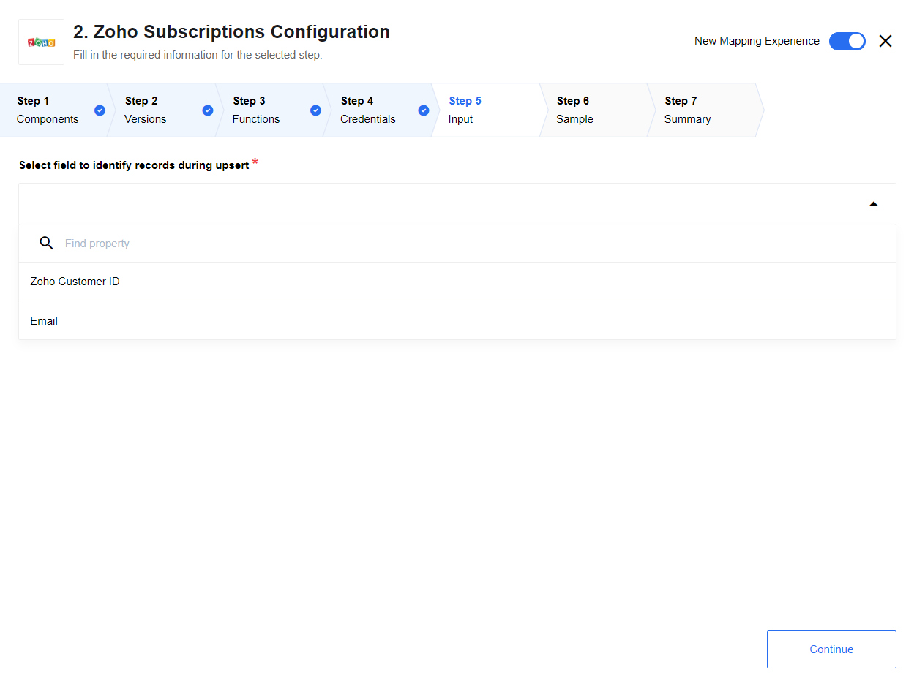
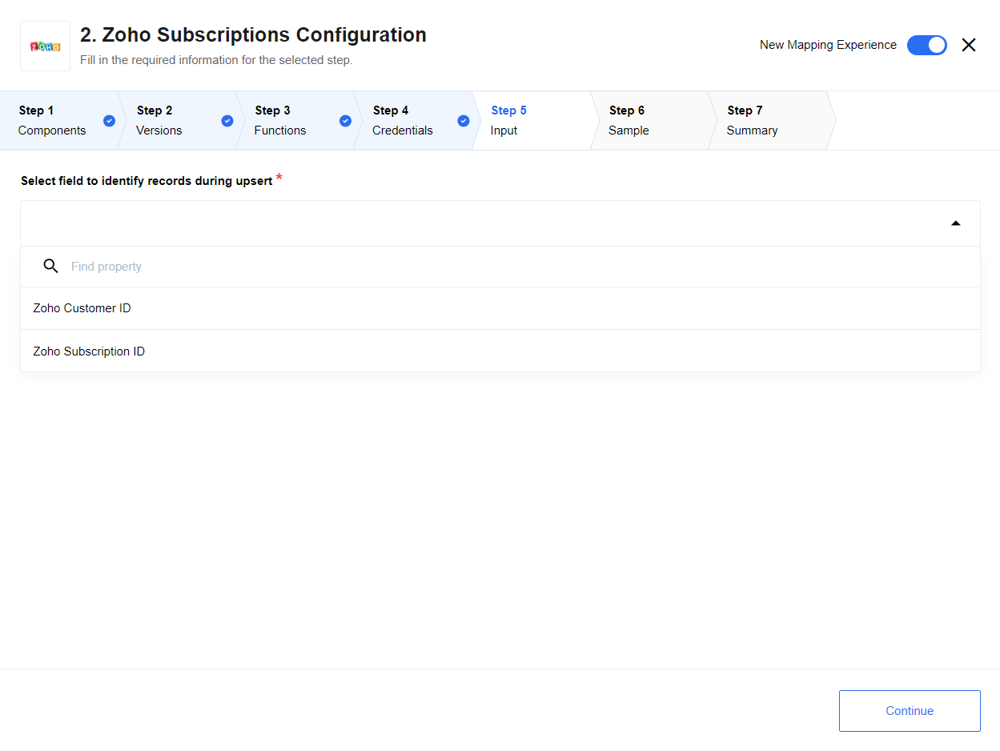

## Introduction

Zoho Subscriptions is a cloud-based recurring billing and subscription solution
in the Zoho product family. It handles every aspect of your subscription-based
business. It can automatically notify you when a payment doesn't go through for
some reason and automatically retries the card again.

## About the component

This is {{site.data.tenant.name}} Zoho Subscriptions integration component. It has
both [trigger](#triggers) and [action](#actions) functions which means you can
use it either to execute or to act upon a certain event. For example, using it
as a trigger, you can filter existing subscriptions based on a subscription status.
Using it as an action, you can create or update customer data or a subscription.

### API Version

The component uses Zoho Subscription - [API Version 1.0](https://www.zoho.com/subscriptions/api/v1/introduction/#overview)

### Environment variables

| Name                     | Mandatory | Description                                                                                           | Values                              |
|--------------------------|-----------|-------------------------------------------------------------------------------------------------------|-------------------------------------|
| `API_RETRIES_COUNT`      | false     | Set how many time system try to make request to API on errors (3 by default)                          | `integer` above 0 and below 5       |
| `API_REQUEST_TIMEOUT`    | false     | HTTP requests timeout in milliseconds (15000 by default)                                              | `integer` above 500 and below 20000 |
| `FACELESS_RETRIES_COUNT` | false     | Set how many time system try to reload access_token from Faceless service on 401 error (3 by default) | `integer` above 0 and below 5       |

### Credentials

Component version 2.0.0 and higher contains breaking changes due to Deprecating [Support for Authtokens](https://help.zoho.com/portal/en/community/topic/deprecating-support-for-authtokens):
component start to use [Faceless](https://docs.elastic.io/guides/secrets.html) service for authentication, credentials must be re-created.

Zoho REST APIs uses the [OAuth 2.0](https://www.zoho.com/subscriptions/api/v1/oauth/#overview) protocol to authorize and authenticate calls.
During credentials creation you would need to:
- select `OAuth2` drop-down list ``Type``.
- select existing Auth Client from drop-down list ``Choose Auth Client`` or create the new one.
  For creating Auth Client you should specify following fields:

| Field name             | Mandatory | Description                                                                                                                |
|------------------------|-----------|----------------------------------------------------------------------------------------------------------------------------|
| Name                   | true      | your Auth Client's name                                                                                                    |
| Client ID              | true      | your OAuth Client ID (see [Step 1: Registering New Client](https://www.zoho.com/subscriptions/api/v1/oauth/#overview))     |
| Client Secret          | true      | your OAuth Client Secret (see [Step 1: Registering New Client](https://www.zoho.com/subscriptions/api/v1/oauth/#overview)) |
| Authorization Endpoint | true      | set: `https://accounts.zoho.com/oauth/v2/auth`                                                                             |
| Token Endpoint         | true      | set: `https://accounts.zoho.com/oauth/v2/token`                                                                            |

- fill field ``Name Your Credential``
- fill field ``Scopes (Comma-separated list)`` List of scopes available in Zoho Subscriptions you can find [here](https://www.zoho.com/subscriptions/api/v1/oauth/#overview), for current actions and triggers following scopes is required:
`ZohoSubscriptions.settings.READ`, `ZohoSubscriptions.customers.READ`, `ZohoSubscriptions.customers.UPDATE`, `ZohoSubscriptions.customers.CREATE`, `ZohoSubscriptions.subscriptions.CREATE`, `ZohoSubscriptions.subscriptions.UPDATE`, `ZohoSubscriptions.subscriptions.READ`
but if you don't want to restrict your client, just use `ZohoSubscriptions.fullaccess.all`
- fill field ``Additional parameters (Comma-separated list)`` as `access_type:offline`
- click on ``Authenticate`` button - the process would take you to Zoho to log-in and give permissions to the platform to access your service.
- click on ``Verify`` button for verifying your credentials
- click on ``Save`` button for saving your credentials

### Technical Notes

Please check the [technical notes](technical-notes) page which lists in-depth
technical details about Zoho component like the recent [changelog](technical-notes#changelog).

## Triggers

### Get All Subscriptions

Filters existing subscriptions based on `Subscription Status`. You can select
any custom or built-in ``Subscription Status`` for your Zoho Subscription instance.

#### Input field description

`Subscription Status`: Drop down menu where you have to select the type of status
you want to filter subscriptions.
`Email` : Filters subscription based on customer email address.

## Actions

### Retrieve Customer

Due to some limitations of Zoho Subscription API, you cannot check if a customer
exists. As a result, this action allows you check if a customer exist by inputting
their `Email`. If customer exists it returns an object of the customer and its
data and if customer doesn't exist it returns an empty object.

### Upsert Customer

Lookup an object by `Zoho Customer ID` or `Email`. Action creates/updates a single
object. Input metadata is fetched dynamically from your Zoho Customer account.
Output metadata is the same as input metadata, so you may expect all fields that
you mapped as input to be returned as output.

### Upsert Subscription

Lookup an object by `Zoho Customer ID` or `Zoho Subscription ID`. Action creates/updates
a single object. Input metadata is fetched dynamically from your Zoho Subscription
account. Output metadata is the same as input metadata, so you may expect all
fields that you mapped as input to be returned as output.

## Known Limitations

As of right now the component does not take in account for Customers who wants
an online subscription which will charge the customer’s card automatically on every renewal.
