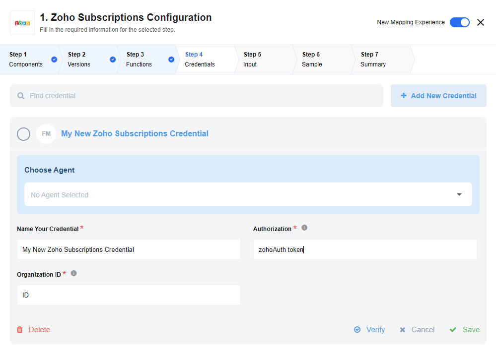

## Latest changelog

**1.0.1 (December 30, 2019)**

* Update sailor version to 2.5.4
* Refactor console log to built in sailor logger
* Change build type to `docker`

> To see the full **changelog** please use the following [link](/components/zoho/changelog).

## Description

{{site.data.tenant.name}} iPaaS component that connects to Zoho Subscriptions API

### Purpose

Zoho Component is designed for Zoho Subscription API integration

### API Version

The component uses Zoho Subscription - API Version 1.0

### Authenication

All Zoho Subscriptions APIs requires a minimum of two mandatory headers.

1. Authorization - Authentication request header. (Zoho Authtoken)

2. X-com-zoho-subscriptions-organizationid - the header that contains the organization ID of the organization you need to access.

``Zoho Authtoken`` : Obtaining an authtoken in your browser is very simple. Login to your Zoho Account and go [here](https://accounts.zoho.com/apiauthtoken/create?SCOPE=ZohoSubscriptions/subscriptionsapi).

``Organization ID`` : Each organization is an independent Zoho Subscriptions Organization with it’s own organization ID, base currency, time zone, language, customers, reports, etc. To obtain ID follow these [steps](https://www.zoho.com/subscriptions/api/v1/#organization-id).

## Credentials

During credentials creation you need to:

- Name your credential according to what organization you are using. For example, test environment should be explicitly labeled as ``test``.
- Enter ``Zoho Authtoken`` for ``Authorization``. <b>Note:</b> Do not include the word ``Authtoken`` and only input the actual token ID.
- Enter ``Organization ID``
- Verify and save new credentials

## Triggers

### Get All Subscriptions  

Filters existing subscriptions based on ``Subscription Status``. You can select any custom or built-in ``Subscription Status`` for your Zoho Subscription instance.

#### Input field description

``Subscription Status`` : Drop down menu where you have to select the type of status you want to filter subscriptions.
``Email`` : Filters subscription based on customer email address.

## Actions

### Retrieve Customer

Due to some limitations of Zoho Subscription API, you cannot easily check if a customer exists. As a result, this action allows you check if a customer exist by inputting their ``Email``. If customer exists it returns an object of the customer and its data and if customer doesn't exist it returns an empty object.

### Upsert Customer

Lookup an object by ``Zoho Customer ID`` or ``Email``. Action creates/updates a single object. Input metadata is fetched dynamically from your Zoho Customer account. Output metadata is the same as input metadata, so you may expect all fields that you mapped as input to be returned as output.

### Upsert Subscription

Lookup an object by ``Zoho Customer ID`` or ``Zoho Subscription ID``. Action creates/updates a single object. Input metadata is fetched dynamically from your Zoho Subscription account. Output metadata is the same as input metadata, so you may expect all fields that you mapped as input to be returned as output.

## Limitations and Next Steps

As of right now the component does not take in account for Customers who wants an online subscription which will charge the customer’s card automatically on every renewal.
